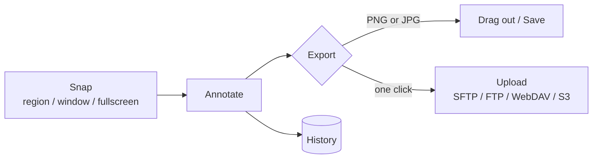

# OpenSnap

A fast, minimal screen-capture and annotation app for macOS 26.

   

## ✨ Features

| | |
| --- | --- |
| 📸 **Snap** | Region (crosshair with magnifier), window, fullscreen and Frame captures. A snap covers the display under the pointer. |
| ⏱️ | Timed snap with an on-screen countdown. |
| ✏️ **Annotate** | Select, arrow, line, rectangle, ellipse, brush, text, fill and eraser tools, colors, sizes, crop and resize, Undo/Redo. |
| 🖼️ **PNG or JPG** | A footer PNG / JPG toggle. PNG keeps transparency; every JPG is written at 75%. The choice applies to drag-out, export, upload and History. |
| 🖱️ **Drag out** | Drag the image straight into Mail, the Desktop or any app. |
| ☁️ **One-click upload** | Upload to SFTP, FTP/FTPS, WebDAV or S3-compatible destinations. Keep several, mark one as the default, and right-click the upload button to switch. |
| 🕘 **History** | Past captures are kept in History for reopening, re-exporting and uploading. |
| 🫧 **Liquid Glass UI** | An icon-only Liquid Glass interface with tooltips on every control. |



## 📋 Requirements

- macOS 26 or newer, Apple Silicon (arm64).
- Screen Recording permission (System Settings > Privacy & Security). Without it captures come back empty.

## 🔨 Build and test

```sh
./tools/build.sh                       # builds build/OpenSkitch.app
python3 tools/test.py                  # every suite; add --concurrent-app-safety for the isolation proof
python3 tools/test-native-startup.py   # launches the built app against throwaway storage
./tools/eye-dump.sh                    # saves PNGs of the app's own windows to build/eye-dump/
sh tools/release.sh VERSION            # release zip + manifest (see below)
```

Run `tools/build.sh` before `tools/test-native-startup.py`, and quit a running copy of the app first; the startup script refuses otherwise. The Xcode command line tools provide the Swift toolchain.

The app icon is a Liquid Glass `.icon` built with `actool`, with a flattened `.icns` fallback. The icons in the UI use Font Awesome Pro when it is available and SF Symbols otherwise. The Pro fonts are licensed, so they are optional and never committed: with your own token in `FONTAWESOME_TOKEN`, run `OPENSKITCH_FETCH_FONTAWESOME=1 ./tools/build.sh` and the build downloads the package, subsets only the glyphs the app uses into the git-ignored `build/fonts` and bundles them.

## 📦 Releases

`sh tools/release.sh VERSION` runs on a clean tree. It refuses a VERSION that differs from `Info.plist`, refuses uncommitted changes, builds without Font Awesome Pro, copies the bundle to a private staging directory, fails if that copy contains any font file, verifies the signature and writes `build/OpenSkitch-VERSION-arm64.zip` plus `build/release-manifest.json` (version, git SHA, binary and zip SHA-256).

Release builds are ad-hoc signed and not notarized, so Gatekeeper blocks the first launch of a downloaded copy. Verify the download first: `shasum -a 256` of the zip must equal `zip_sha256` in the manifest. Then try to open the app once and choose Open Anyway in System Settings > Privacy & Security, or run `xattr -dr com.apple.quarantine` on the app.

This release renames the app to OpenSnap (bundle identifier `com.shoemoney.opensnap`, Application Support folder `OpenSnap`, `.opensnap` documents). On first launch it copies data from the previous app's folder, leaving the old folder untouched, and converts History to the new format. Files in the old `.skitch` format are no longer opened.

## 🕰️ History

OpenSnap began as a rebuild inspired by Skitch. It no longer contains Skitch code, art or assets.

## 📄 License

MIT. See `LICENSE`.
