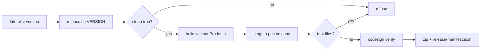

# OpenSkitch

A personal native AppKit reconstruction of Skitch 1.0.12 for macOS 13 and newer. The build targets Apple Silicon with a native 64-bit arm64 executable; Intel builds are no longer required. Full original feature parity remains in progress.

   

> 🚧 **Honest status:** a reconstruction, not the original. Passing tests prove the reconstruction, not original equivalence, and no capture behavior that needs Screen Recording has been verified live on the development host.

## Build and run

```
./tools/build.sh
open "build/OpenSkitch.app"
```

OpenSkitch was previously named Skitch Redux. Existing document identifiers, application-support storage, preferences and Keychain entries retain their compatibility names so the rename preserves drawings, History and sharing settings. The project lives in `~/Projects/OpenSkitch`; the old project path remains a compatibility symlink for existing evidence and scripts.

The original ZIP and extracted bundle must remain in `original/` for original interface artwork and sound resources. The company logo in `Resources/OpenSkitch.png` is the app icon source; the build creates all standard macOS icon sizes and packages `OpenSkitch.icns`, preserving transparency. They are deliberately excluded from Git, along with the decompiled analysis and build outputs. The original ZIP SHA-256 is `b2f4181f5eb40a570547054e8ec22ca9bbe490eca02a28e2389fc5d83fdc6e97`.

## Modern appearance

On macOS 26 and newer OpenSkitch opens in the Modern appearance by default; Classic, the recovered Skitch 1.0.12 interface, stays selectable in Preferences and applies the next time OpenSkitch opens; the Appearance row's Relaunch OpenSkitch button quits through the normal Save prompt and starts the new instance for you. Earlier systems always use Classic.

Modern draws its icons with Font Awesome Pro when it is available and falls back to SF Symbols when it is not. The Pro fonts are licensed, so they are optional and never committed: with your own Pro token in `FONTAWESOME_TOKEN`, run `OPENSKITCH_FETCH_FONTAWESOME=1 ./tools/build.sh` and the build downloads the package, subsets only the glyphs the app uses into the git-ignored `build/fonts` and bundles them. Without a token the build still succeeds and uses SF Symbols.

## Releases

Release builds come from `sh tools/release.sh VERSION` on a clean tree. It refuses a VERSION that differs from `Info.plist`, refuses uncommitted changes, builds without Font Awesome Pro, copies the bundle to a private staging directory, fails if that copy contains any font file (by extension or magic bytes, anywhere in the bundle), verifies the signature and writes `build/OpenSkitch-VERSION-arm64.zip` plus `build/release-manifest.json` (version, git SHA, binary and zip SHA-256).

Release builds are ad-hoc signed and not notarized, so Gatekeeper blocks the first launch of a downloaded copy. First verify the download: `shasum -a 256 OpenSkitch-VERSION-arm64.zip` must equal `zip_sha256` in the release manifest. Then, on macOS 15 and newer, right-click > Open no longer bypasses Gatekeeper: try to open the app once, then go to System Settings > Privacy & Security and choose Open Anyway. Alternatively remove the quarantine flag with `xattr -dr com.apple.quarantine OpenSkitch.app`. Font Awesome Pro is never shipped: public builds draw the Modern appearance with SF Symbols.

## What landed for 0.3.0

| | Change |
| --- | --- |
| 🌘 | On-screen shadows fall down-right like the export and the original; the canvas visual proof now compares with shadows on (0 of 237,760 pixels differ). |
| 🧪 | Concurrent app-safety runs: `tools/test-app-safety.sh` uses a per-run binary name and its own defaults domain, and `python3 tools/test.py --concurrent-app-safety` proves Classic and Modern can run at the same time. |
| 🔤 | The Fonts panel sets `rowHeight` only on item-based `NSBrowser` delegates (all four item methods). |
| 📦 | Version 0.3.0 (build 3), `tools/release.sh`, a font guard and `OPENSKITCH_NO_PRO_FONTS=1` in `build.sh`; the About panel reads the bundle version. |
| 🧽 | Wipe resets the viewport (crop, pan, render size) when no snapshot remains, like the original `wipeTA`. |
| 🪟 | Frame mode drops the window shadow, raises the window to screen-saver level and dims it to 0.8, then restores the pre-Frame values on leave (both appearances). |
| ⌨️ | Two new global hotkey actions: Upload (default Command+Shift+Control+5) and Show Skitch (no default). A cancelled capture never publishes. |
| 👋 | First launch with an empty application-support folder opens the bundled `firstlaunch.skitch` as an unsaved "Welcome" document, once. |
| 🔷 | Line tool polygon follows the original: holding Option keeps the polygon open and releasing Option ends it. |
| ⚡ | A white flash panel follows successful captures, with the original 0.1 s timing (region, window, Frame, fullscreen). |
| 🔍 | Crosshair magnifier geometry (10x zoom, 100x100 lens) sits behind the `showCrosshairMagnifier` preference. The crosshair picker now takes a screen-image provider and feeds the lens; the native provider grabs the screen and returns nothing without Screen Recording permission, so the lens stays grey then. Tests use an injected synthetic image; **live magnifier pixels are not verified.** |
| 🖱️ | Modern canvas border corner and edge mouse gestures are proven equal to Classic. |
| 📋 | Every `unimplemented` row in `analysis/reconstruction-progress.json` has a disposition (see Not reconstructed). |



## Current functionality

Native capture controls, editable annotation tools, text, selection, undo, groups, cropping, resizing, rotation, flipping, clipboard import/export, drag export, local history, session recovery, printing, image exports and SVG export are implemented. Actual Size preserves normal output history and restores the normal window on exit, with a native overview navigator for panning. Border drags crop or expand the visible canvas, Option applies symmetry, and corner drags resize output with one Undo step. Raster imports and ordinary captures fit their output to the available screen while retaining full source pixels. The original bundled `firstlaunch.skitch` opens with editable paths and text. Save now uses SVG-native `.skitch` files with original attributes and supplemental editing state; existing `.skitchredux` JSON remains supported. Native save, recovery and history retain background pixels hidden by panning or cropping. Complete historical file interoperability remains unverified.

The tool sidebar shows the original active/inactive icons and a persistent accent highlight, with accessible names and tooltips. Crop and Font use readable18-point labels. Selected controls adapt for contrast with bright or dark accent colors, including when the app is inactive. Button changes and Tab Pencil switching keep one selected tool synchronized. Successful Save shows the actual output filename. Export uses the recovered Export/Export As labels, updates the filename extension when the format changes, and previews encoded bytes.

Page Setup opens the native macOS dialog. Cancel preserves existing print settings; OK retains the chosen settings for printing. Orientation cancel/accept/reopen was checked on the desktop; actual printer output and original scaling/margins equivalence remain unverified. The native Window menu restores Bring All to Front and lists the active document. Hide Others and Show All use the directly recovered native responder actions.

Close and Hide now toggle the editor's visibility; the Minimize menu invokes the recovered vanish path. Hiding retains the drawing and pauses its recovery timer instead of requesting Quit. Editor shrink and restore use the recovered 15-frame sequence and the live menu-icon window frame; hiding an existing drag thumbnail uses 25 frames. Reopening restores the same editor, including while an auxiliary window exists. The recovered statusMenu key installs the original menu-bar icon by default and selects native Dock miniaturization for value2. Reduce Motion and missing icon geometry fall back to immediate transitions. Controlled tests cover pending typing, Undo, geometry, timer sequencing, interrupted animations, modal-sheet protection and explicit Quit after Close. Previous-app focus remains unfinished. Native Preferences now exposes the recovered Both/Menu bar/Dock values, applying modern Dock/menu presence immediately; original bundle rewrite/relaunch behavior is intentionally adapted. Native Close, Hide, menu Minimize and Finder reopen retained the same drawing and window frame on the earlier Close/Hide checkpoint. That checkpoint also checked active text editing, native typing Undo/Redo and a separate Save As; red Close started the15-frame menu-target transition and completed hidden. These desktop checks are historical and have not been repeated on the compact-bezel build. Intermediate animation pixels, menu-icon click, the physical yellow Minimize button and original compositor equivalence remain unverified.

Drag Me now uses a document preview instead of a generic symbol. Leaving its screen-space bounds creates a separate floating snapshot of the editor, centered on the control with the recovered 128-point long side and 90-point minimum dimension. Successful drops leave the original Show Skitch artwork on a click-to-expand thumbnail; cancelled drops and failed promised-file writes restore the same editor. Drag start commits pending text as the recovered stopFieldEditing action did, retaining document Undo. Promise completion archives the captured drawing rather than a later replacement. Shrink and restore use the recovered corner curves, 25/15-frame sequences and 20ms timer, including event-tracking and modal run-loop modes. The native snapshot overlay ignores mouse input, and Reduce Motion keeps immediate transitions. Reopen, Quit and document replacement retire interrupted animations. Controlled tests cover these paths, original sizing, duplicate starts, early/late delivery, stale callbacks, projection orientation and Retina scaling. Actual native Finder/application drop, hover artwork, full-window snapshot equivalence and original compositor interpolation remain unverified.

Frame Snapshot opens a see-through canvas. Snap Frame captures its bounds; Re-snap keeps the annotations while replacing the picture. Drawing gestures include temporary Command selection, Control erasing, Space panning, Tab Pencil switching, Option-drag copying, an eyedropper, and Justype text entry. The Wipe button reads Blank (disabled) on an empty white drawing, Clear when only a snapshot or non-white backdrop remains, and Wipe when there is artwork or a field being edited; it clears annotations first and the snapshot second, while Wipe Snap Only retains annotations. When no snapshot remains, Wipe also resets the crop, pan and render size in the same Undo step, as the original did. Entering Frame removes the window shadow, raises the window to screen-saver level and sets alpha 0.8; leaving restores the values it had before Frame, in both appearances. With the Line tool, holding Option keeps a polygon open and releasing Option ends it. Photos offers chosen-folder thumbnails and the system Photos picker for user-selected images.

Fill and erase now use editable vector geometry, including holes, disconnected fragments, contact grouping, Shift-fill and translucent source-over blending. Text and positioned photographs are protected from the eraser. Pencil uses recovered pressure scaling, a rotated nib, cubic fitting and Precise/Medium/Loose smoothing; Shift uses the original precision override. Smoothing is available in the Drawing menu. Real tablet hardware and exact historical output remain unverified.

Custom publishing supports SFTP using the existing SSH configuration, plus FTP, FTPS and WebDAV. The configured personal destination is `shoemoney.com`, remote folder `/var/www/shoemoney.com/shared/imgs`, and public links under `https://shoemoney.com/imgs/`. SSH keys remain in their configured locations. Password destinations use macOS Keychain. Webpost… (and File › Publish Image…, and Snap & Upload) uploads in one click to the configured destination with no confirmation sheet, shows "Uploading <name>…" then "Link copied: <url>" in the status bar, and ignores a second click while an upload runs; right-click or Control-click the button for the destination menu, Destination Settings… and Share with macOS… (also File › Share…). Modern shows Webpost as an icon-only cloud-upload button.


### Upload destinations and S3

Webpost uploads to the default destination. Destination Settings… (right-click Webpost, or Preferences) lists every saved destination with Add…, Edit…, Remove and Make Default; the right-click menu lists them all with the default checked, and choosing one makes it the default. Destinations live in `destinations.json` under `~/Library/Application Support/SkitchRedux/Publishing`; the older single `destination.json` is migrated on first launch (it becomes the one entry and the default, its Keychain item is untouched, and the old file is kept as `destination.json.pre-destinations.bak`). Passwords never appear in that file.

An S3-compatible destination (AWS, Cloudflare R2, Backblaze B2, DigitalOcean Spaces, Wasabi, MinIO) takes an optional endpoint (blank means AWS), region, bucket, key prefix and public base URL. Credentials come from an AWS shared-credentials profile (`~/.aws/credentials`, including an optional session token) or from an access key and secret stored in Keychain. Uploads are signed `PUT`s through system curl (`--aws-sigv4`), always path-style (`https://s3.<region>.amazonaws.com/<bucket>/<key>`, so bucket names with dots work), the key pair and any session token travel only on curl's stdin config, no ACL header is sent unless "public-read" is ticked, and file names are reduced to `A-Z a-z 0-9 . _ -`. After a 200 the public URL is downloaded and compared byte for byte before the link is copied. The sheet's Test button runs a signed `ListObjectsV2` with `max-keys=0` under the prefix and uploads nothing.

Explicit live check (never part of the test suites): build the destinations test binary and run `--live-s3 "<destination name>"`; it uploads a tiny PNG named `openskitch-live-check-<uuid>.png`, verifies the public URL, prints it, then deletes the object with a signed DELETE.

## Validation and remaining work

Run `./tools/test.py --arch arm64` for the native regression suites; on macOS 26 and newer its app-safety suite runs once pinned to Classic and once to Modern (`./tools/test-app-safety.sh --appearance classic|modern` runs either alone). Add `--concurrent-app-safety` (`python3 tools/test.py --concurrent-app-safety`) to prove Classic and Modern can run at once, and `tools/check-dispositions.py` (run by `tools/test.py`) to keep every unimplemented row dispositioned. Measured on the merged tree at db84445: AppSafety 96/96 Classic (re-run in a docs worktree) and 16/16 Modern, the full `python3 tools/test.py` passes with no source drift, and the startup smoke passes in both appearances with 3/3 relaunches. After rebuilding, run `python3 tools/test-native-startup.py` to exercise the actual Apple Silicon app's startup, native save/reopen, PNG rendering and AppKit Quit with isolated session storage, in Classic and Modern (each checked for its own chrome), plus the Preferences Relaunch button replacing the running process. Executable suites live in `tests/`. Canvas checks cover editable state, transforms, grouping, clipping, text, eraser behavior and gestures. File checks cover original attributes, editable state and hidden pan pixels. Capture, publishing and Photos teardown checks use controlled local workers; they do not grant permissions or upload files. Quit waits for helper exit and owned temporary-file cleanup. Real SFTP uploads have been checked independently. Desktop checks are recorded separately from unit tests.

History now has a native thumbnail grid, literal search over name/link/annotation text, action filters, recovered date predicates, local date sections, details and an independent drag format. Successful save/export/drag/publication actions archive editable copies; subsequent edits follow the current copy without ending active typing. History Open retains previous document identity and Undo. Local removal can move copies to Trash, while web deletion requires a publication-time destination binding and unchanged settings. Web deletion currently refuses this host's SSH configuration because an Include is outside its supported configuration tree; SFTP upload remains verified. A bounded reader copies legacy keyed-archive records without instantiating arbitrary archived classes; this is verified with synthetic fixtures, since no real legacy index was available.

Resize now changes normal output dimensions while retaining source pixels and annotation geometry. A native sheet offers proportion locking, crop dimensions and nine crop anchors, width/height/longest-side limits, the original built-in presets and saved custom presets. Apply previews from one baseline, Cancel reverses the preview, and OK records one edit. Unlocked Resize fits proportionally and adds centered space instead of stretching pixels. Border crop retains hidden artwork through save/reopen, rotation and flipping; Crop Snap at Current Edges trims only the photograph. Export supports PNG/JPEG/TIFF/GIF/BMP/PDF/SVG/Skitch, original-size rendering, separate JPEG quality controls, Drag Me format choices and encoded-byte feedback. Pending-text export leaves the editor and Undo intact. Native corner/border gestures and Actual mode are implemented and tested. The original corner/edge crop-resize rules recovered from `ActionCropResize` (Option is a centred resize, a proportional minimum applies, the original has no crop handles in Actual mode) are written up in `docs/adr/0001-crop-resize-original-rules.md` and encoded in `tests/WindowSizingTests.swift`; the ADR leaves the integer meaning of the original snap mode unresolved (snap mode 1 with Shift is not honoured yet), assumes a clamped drag keeps its last preview, and notes that edge-crop rounding is not in the decompile. Exact original window limits, navigator layout and auto-fit remain unverified. Image > Add Shadow is reconstructed from `MacImage::addShadow`/`addShadowTA`: the canvas grows 27x27, the picture sits at (14,6) and one NSShadow (offset 8 down, blur 27, alpha 0.8) is drawn, as one Undo step. New and Open now register one Undo that restores the previous document (the original `loadFromFileTA`) instead of clearing Undo.

Text now has a context Style menu and a floating native Fonts panel with family, face and size choices, mixed outline/shadow controls and Default Skitch Style. Changes apply live to each selected annotation. Pending typing, font/effects and grip movement stay in one document transaction; native typing Undo/Redo keeps the staged display style. The default action restores the recovered Helvetica Bold face and both effects while preserving selected sizes and annotation colors. Spelling commands route to the active native text responder, with continuous checking enabled when annotation editing starts. The recovered move grip keeps typing active and includes placement in recovery, save and one combined text Undo. While editing, the grip replaces the annotation's selection box; other selected artwork keeps its handles, and committed text regains handles at its new position. Outline contrast and thickness now use the recovered Float32 brightness threshold and font formula, capped at eight drawing units. Both the native field and image renderer draw the outline first and the colored fill second, with rounded joins, the original black shadow and group transparency. Ordinary SVG uses the same contrast and paint order with a separate text shadow. Full original-runtime comparison, close-button reachability, transformed editor typography and full mixed-font presentation remain unverified.

Fonts now displays and converts sizes using output/logical image height, excluding editor zoom. The recovered selectionHasChanged and updateTextFontTA paths both use Document::displayFontScale (original addresses0x1d7a16,0x1dae60 and0x1c22f0). Controlled tests vary zoom separately from output resizing, preserve mixed sizes/effects and retain pending typing. Earlier exact-binary native interactions and live panel metrics confirm a single24-point annotation stays24 in Fonts at Fit and25% zoom; mixed-size selection has a blank field. The desktop binding exposed only the editor window, so the auxiliary Fonts layout and direct family/size editing remain visually unverified.

Opening the preserved mixed-font fixture caught an early Redux file regression after export defaults changed. Those version1 writers omitted their fixed drawing defaults from supplemental metadata. Import now retries only that known default profile and the historical fixed text-effect profile, requires the complete regenerated SVG to match, and retains recovered defaults explicitly. Conflicting hidden models and independently changed visible SVG are still rejected. It does not accept arbitrary root edits or conflicting hidden artwork. The actual preserved fixture now opens, saves separately and reopens with the exact document model unchanged; both fonts and differing effects are visible in reviewed editor screenshots. Complete historical Skitch interoperability remains unverified.

The main interface follows the archived1.0.12 control groups: Cursor, Brush, Line, Circle, Rectangle, Fill, Eraser, Text and Arrow on the left; Snap, Color, Font, Size and lower Undo/Wipe on the right; Actual Size/Resize at lower left. Frame is a menu command that adds Cancel beneath Snap and changes Snap to Snap Frame. The original Cam button was removed by product decision (OpenSkitch is screen capture only). Hide and Save-to-History/History occupy the top. Original icons and frame artwork are packaged. Photos and Crop remain additional affordances from the reconstruction. The supplied ShoeMoney logo and native20-point OpenSkitch text are centered on the window, with minimum gaps around the command groups. Horizontal icon/label buttons and expanded readable geometry are modern adaptations; original cluster hover/rendering remains unverified. Toolbox presents supported commands in archived flat group order; More Commands retains the additional menu actions. Only normal Snap has the recovered Fullscreen secondary action. Save and its arrow both mean Save to History. Tool buttons retain native cells and original artwork with pressed/disabled/focus-mask adaptations. Current shortcuts remain adaptations to the original defaults. Readable application controls stay at18 points or above, with20-point filename, format and primary menu/export text. Controlled tests check typography, top alignment, reachability, viewport separation and menu actions at default and minimum sizes. Earlier compact-bezel desktop checks cover Toolbox Open, one temporary-arrow Undo, JPEG/PNG switching and separate Save As. Those checks remain pinned to their earlier binary. Exact original geometry, cluster hover/state rules, hover palette placement and the remaining original preference controls remain incomplete or unverified.

Drawing colors expose the ten original preset tags and RGBA floats, including translucent gray and yellow highlighter. Swatches use original calibrated colors; stored drawing colors retain the raw components. The custom-color panel converts calibrated components to original Float32 drawing values, including when macOS invokes its conventional changeColor action. Its target/action are installed before its initial color. Recolor preserves mixed font, stroke, fill and effect styles, and pending typing keeps its staged color through save and combined Undo. Native hover tracking now opens the palette without intentionally moving text focus and retires it after leaving both Color and the palette. A120ms bridge accommodates the modern popover gap; clicking pins a hover-opened palette for accessible click/keyboard use. Isolated AppKit tests cover hover transitions, focus retention, cancelled dismissal, hidden/modal protection and retired callbacks. Actual idle-pointer hover and original panel placement/timing remain unverified.

Size uses the original1.5...12 range and five steps, Shift-continuous mouse/keyboard adjustment, native slider accessibility and original track/knob artwork. The recovered font polynomial and output-to-logical height ratio drive future brush and selected/future text sizing independently of editor zoom; individual fonts/effects and existing paths remain intact, with grouped Undo for continuous selected-text changes. The18-point annotation floor and4096-point stored-font ceiling are explicit readability adaptations. Changed brush color/alpha, Size and custom RGB/alpha now persist in original SVG root attributes and restore on Open, session recovery and History restoration. Global/new-document preference migration and full original-runtime equivalence remain unverified.

New arrows use the recovered Float32 tapered outline: three cubic curves, four straight edges and a rounded tail. Drawing > Arrow Head exposes the original Start=1 and End=2 choices using the original arrowHead preference key. Option temporarily reverses direction in preview and on release; Shift uses the recovered strict 2:1 axis thresholds and max-axis diagonal length. Mouse release retains the last dragged endpoint. New arrows serialize as editable filled paths; previously saved reconstruction arrows retain their existing representation. Current Apple Silicon desktop checks cover both direction choices, per-arrow Undo/Redo, separate Save As/reopen, unchanged prior text and preference persistence after actual Quit/relaunch. Option/Shift transitions are covered by controlled AppKit events; sustained modifier-plus-drag desktop input is unavailable through the current desktop tool. Original display-scale/shadow equivalence remains unverified. The arrow desktop checks remain pinned to their exact earlier binary; current build and test evidence lives in `analysis/build-validation.json`.

The earlier text-key checkpoint covers ordinary Return creating a line, Command+Return retaining native editing, Option+Return and keypad Enter completing annotations, one drawing Undo/Redo per annotation, separate Save As and native Open. The completion predicate follows recovered keyDown code: Escape always completes; Option+Return completes; Enter completes with the numericPad flag or device-only flags below 0x10000. Other keys pass to native NSTextView. Earlier natural text growth/shrinkage, text-effects, Fonts metrics, minimum-window/color/Size and Close/Hide desktop proofs remain pinned to their exact binaries. Intel builds and testing are no longer required. Native system-panel alpha entry, auxiliary Fonts visual/direct-choice verification, affine-transformed live editor presentation and full original-runtime equivalence remain unverified. Changed words and fonts fit natural width; opening an unchanged drawing preserves its stored geometry. Source dimensions use the original font independently of the eighteen-point displayed-font floor at small zoom.

Current user priority is the classic native interface first: control spacing, button states, tool feedback and panel consistency. Corner dragging and resizing remain required after that interface pass. The interface Apple Silicon checkpoints pass the full regression suite and native save/reopen/render/Quit checks. Desktop review confirms their listed company header, tool selection, Toolbox, and Frame controls; desktop reports stay pinned to their exact binaries. Real Snap still reports denied Screen Recording permission. Menu rendering/scroll reachability, full menu execution, Fonts presentation, held-button feedback and native keyboard focus remain unverified.

Important remaining gaps include exact original Boolean tolerance/growth and separated color-run fill behavior, tablet hardware and exact original fitted-stroke output, some original modifiers, exact original window sizing, border limits and navigator layout, complete historical file interoperability, real legacy History-index interoperability, exact original History date labels/DST behavior and sharing details, exact capture behavior across displays and legacy service behavior. Actual screen-capture permissions, tablet hardware, the system Photos-library picker and unfocused global shortcuts still need desktop verification. The chosen-folder Photos browser, full-resolution open, Justype, Pencil toggle, native editable save/reopen and SFTP publication have been checked in the desktop app. Original online account services and obsolete update/crash endpoints cannot be assumed operational. Full original-runtime visual equivalence has not been established.

Native Preferences uses General, Drawing and Snapping tabs recovered from the original 1.0.12 nib. Sound polarity, Both/Menu bar/Dock tags, precision tags, arrow direction and capture inclusion use their original keys; changing settings retains pending text and document history. Existing Pencil precision choices remain readable, and a missing precision key follows the original engine Medium fallback. Manual Option temporarily reverses fullscreen/crosshair inclusion; global shortcuts use the saved choice and timed Snap retains its pre-prompt modifier. Global shortcuts now include Upload (default Command+Shift+Control+5), which captures with the crosshair and publishes only if the capture succeeds, and Show Skitch (no default). Original sound assets are packaged, with Wipe and accepted Snap feedback routed through the sound setting. Utility Close targets the focused window, successful Snap dismisses Preferences, and capture restoration leaves dismissed windows closed. Other original tabs, AllSpaces, watermark, full sound-event mapping and original-runtime focus/capture equivalence remain open.

Screen selection now uses an owned native crosshair overlay: drag a region or click a window. On multi-display setups a snap covers only the active display, the one under the mouse pointer when the snap starts: Fullscreen captures that display (not always the main one), and the crosshair overlay, magnifier feed and window clicks stay on it, so a region can no longer span two screens (a deliberate deviation from the original, which spanned all displays; Frame mode is unchanged). Selection samples Shift at completion, then runs the recovered six-second Float32 countdown with original 3/2/1 artwork and sound. Manual Shift Fullscreen and sticky Shift at Frame entry or Snap use the same delay; global Fullscreen ignores unrelated current-event modifiers. The Snap button captures an active Frame, while the Crosshair menu action leaves Frame and starts selection. Cancel Snapshot retires selection, countdown and helper work through the existing cleanup acknowledgement. Explicit custom delay remains an adaptation. Controlled tests cover coordinate conversion, window hit testing, countdown ticks, stale callbacks and capture cleanup. A white flash panel follows each successful capture with the original 0.1 s timing, covered by controlled tests only. The magnifier has the original geometry behind the `showCrosshairMagnifier` preference, and the picker now feeds it through a screen-image provider; without Screen Recording permission the native provider returns nothing and the lens stays grey, and tests use an injected synthetic image, so live magnifier pixels remain unverified. A new Snap during a running capture cancels it and starts the new one, as the original `snapSnap` did (cancelTimedSnap first), instead of reporting that another capture is in progress. `CaptureCoordinator.submit` starts every capture through the run-loop delivery path rather than a MainActor Task. Native desktop capture (Screen Recording has not been verified live on this host), hidden-app overlay focus, multiple physical displays, cursor artwork, timed Escape outside selection remain unverified or incomplete (the countdown wiring is covered by controlled tests only). The camera (iSight, Cam) feature was removed by product decision on 2026-10-08: OpenSkitch is screen capture only. Timed screen output uses the modern helper's cursor inclusion rather than the original forced arrow raster.

General also restores the original Show tool tip overlays and Show keyboard tip overlay controls, including their inverse disableOverlay/disableModtips keys and fresh disabled state. Keyboard help uses the attached top bevel, exact original tool/action copy, immediate-over-hover priority and recovered20ms fades. The native panel stays above the host with40-point side margins, does not intercept input, and clears on focus loss, capture, hide, miniaturization and Quit. Text editing suppresses modifier hints; temporary Space panning has empty Hand help. Control temporarily selects Eraser except for Text, matching the recovered index4 exception; Command still overrides Control. Window fitting uses the recovered overlay-only170-by40 reserve, keyboard-only0-by80 reserve and combined170-by80 reserve. The user readability rule expands wrapped20-point messages instead of reproducing14-point middle truncation. Controlled tests cover these routes, delayed/stale work, geometry and fades. Native checks cover checkbox actions, reopening, restored values and an untouched saved editor. The desktop tool captures the parent window only, so actual child-strip presentation/fades remain unverified. The visible UI governed by disableOverlay is still unproven beyond fitting; cursor overlay images are ungated colorization masks. Universal250ms hover timing and selected-tool canvas help are explicit adaptations until exact per-control behavior is recovered.


## Not reconstructed

Every `unimplemented` row in `analysis/reconstruction-progress.json` carries a `disposition` and a `disposition_reason` (statuses are unchanged). `python3 tools/check-dispositions.py` fails if a row lacks one, and `tools/test.py` runs it.

| Disposition | Rows | Meaning |
| --- | --- | --- |
| `not_reconstructed_retired_service` | 60 | Skitch.com, Evernote, Flickr, MobileMe, TFTP, Sparkle updates, feedback, crash reporting, Doozla and the Plus store are retired services (the `capture.camera-*` rows were removed by product decision, not retired by a service), so their rows and menu selectors are intentionally not rebuilt. Covers `providers.*`, `sharing.*` (destination flow), `edition.*` and the matching `unresolved_action.*` selectors. |
| `deferred_post_0_3_0` | 39 | Real original behavior, deliberately left for after 0.3.0. |
| `needs_user_artifact` | 1 | Cannot be reconstructed without a real legacy file the user must supply (`document.migration`). |
| `planned` | 1 | Covered by a work package in the current completion cycle. |

Retired-service rows by area:

| Area | Rows |
| --- | --- |
| `capture.*` | 5 |
| `export.*` | 1 |
| `sharing.*` | 8 |
| `providers.*` | 20 |
| `preferences.*` | 1 |
| `shell.*` | 2 |
| `edition.*` | 3 |
| `unresolved_action.*` | 20 |

## Original analysis

`analysis/` contains the Ghidra project, Objective-C metadata, disassembly, drawing/document recovery and a feature inventory traced to original resources. Ghidra exported 11,977 functions without function-export failures. The pseudocode does not compile as original source; the application is reconstructed Swift/AppKit code. The original i386 executable has not been run on this Mac.

Recovery scripts: `tools/decompile.sh` and `tools/ExportDecompiled.java`. Ghidra source: https://github.com/NationalSecurityAgency/ghidra.
