# Visual audit — capture gallery

Rendered evidence of the **Modern** UI, gathered by the flag-gated harness (`--eye-dump-audit`, branch `audit/visual-harness`) from an isolated copy of the app: throwaway bundle id, home and support folder; own windows only (CGWindowList by window number); synthetic content only.

Observed-issue bullets describe what is visible in the PNG next to them. Source behaviour is cited in `manifest.json` (`sourceRefs`), never offered as an observation.

**Baseline vs delta.** Captures without a suffix were taken at `b9319c4` (the audit baseline). Files suffixed `@dc1eb26` are the delta set taken after main moved (own drawn countdown digits, PNG|JPG toggle, no Classic/Appearance/Relaunch/welcome). Every manifest entry carries `sourceSha`.

**Size cap.** To keep the folder under 40 MB, window-size captures were downscaled to at most 1200 px wide and every PNG over 150 KB was palette-quantised with `pngquant --quality 85-95`, then `oxipng -o 2 --strip safe`. `pixelSize` in the manifest is the original capture; `storedPixelSize` is what is on disk (small crops keep full resolution). Alert and status-button PNGs are flattened onto a neutral backdrop because the glass material is not captured (see gaps.md).

**Capture limitations seen while reviewing:** menu windows and some overlay windows (colour popover, flash) do not appear in multi-window composites; the Fonts panel's left pane renders blank; the status-bar button is drawn as a bare view. These are harness limits, not product findings.

## Captures at `b9319c4`

| Capture | Light | Dark | Directly observed (this capture) |
|---|---|---|---|
| **S01** editor, empty _fresh blank canvas, default window_ `2048×1544px · 1024×772pt @2x · CGWindowListCreateImage` |  | <a href="S01-editor-empty-dark.png">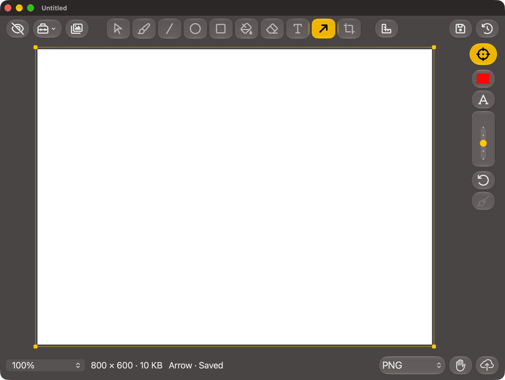</a> | Blank 800x600 white canvas, centred; yellow corner handles; 10 tools + Resize in the glass header; Snap/Color/Font/size/Undo/Wipe stacked on the right; zoom, size, status, PNG popup, hand and upload in the footer. • Right column: Snap, Color, Font, size slider, Undo and Wipe stop about 55% of the way down; the rest of that column is empty window-grey. • Wipe is greyed out on the blank canvas; its disabled state differs from enabled only by a fainter glyph. • The zoom popup is a flat grey rounded rectangle while every other control is a white glass pill. • A thin yellow outline with square yellow corner handles surrounds the canvas, repeating the accent yellow already used on the selected tool and Snap. |
| **S02** editor, populated _synthetic 1200x800 background + arrow, line, rectangle (open+filled), ellipse, brush, highlighter, fill, text (outline+shadow, plain), SVG path, raster_ `3266×2358px · 1633×1179pt @2x · CGWindowListCreateImage` | <a href="S02-populated-light.png">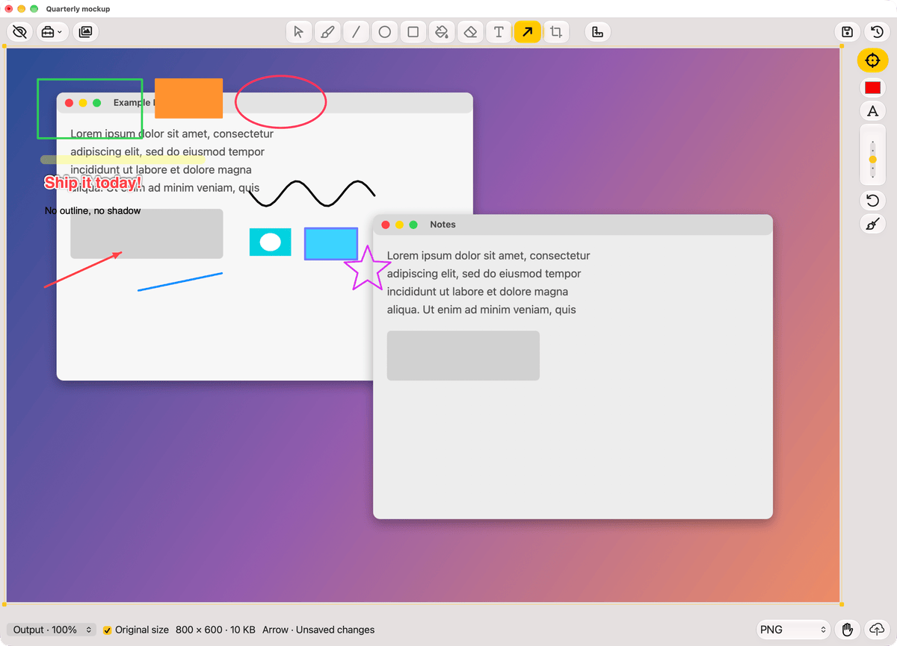</a> | <a href="S02-populated-dark.png">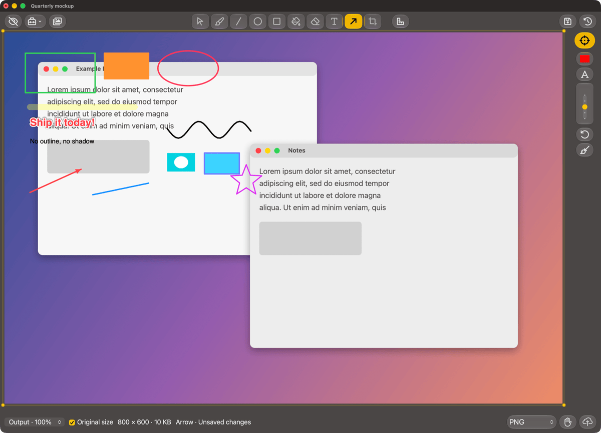</a> | 1200x800 synthetic background with all annotation kinds drawn over it; rail unchanged. • Right column: Snap, Color, Font, size slider, Undo and Wipe stop about 55% of the way down; the rest of that column is empty window-grey. • The highlighter stroke starts with a darker olive/grey round cap that does not match the pale yellow body. • Zoom label reads 'Output · 100%' and a checked 'Original size' box appears; both are jargon beside a plain footer. • Window title shows the document name but the text is small system title text (13 pt). |
| **S03** right rail _Snap, Color, Font, Size slider, Undo, Wipe_ `260×1040px · 130×520pt @2x · CGWindowListCreateImage` |  | <a href="S03-rail-dark.png">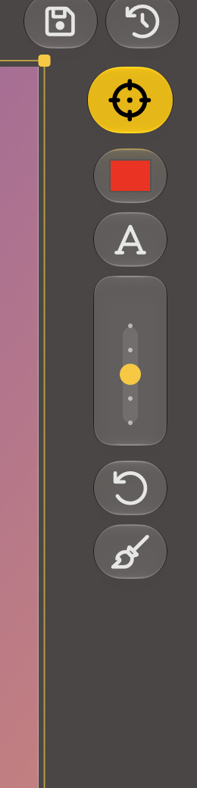</a> | Right-rail crop: Snap, red colour swatch, 'A', vertical slider, Undo, Wipe. • The size slider is a tall vertical glass pill with tiny dots; its value is not visible anywhere. • Right column: Snap, Color, Font, size slider, Undo and Wipe stop about 55% of the way down; the rest of that column is empty window-grey. |
| **S03** title / top-bar chrome _logo-less glass header: Hide, Toolbox, Photos \| ten tools + Resize \| Save, History; title shows document name_ `3122×172px · 1561×86pt @2x · CGWindowListCreateImage` | <a href="S03-topbar-light.png">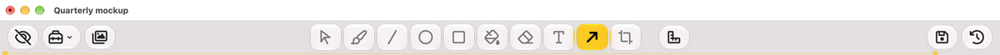</a> |  | Header crop: eye-slash, briefcase menu, photos \| 10 tool glyphs + ruler \| save, history. • Every command is icon-only; the Hide glyph (eye with a slash) and the briefcase with a chevron do not say what they do. • Unselected tool glyphs are mid-grey on pale glass; selected Arrow is solid yellow with a black glyph, a much larger jump than the other tools make. • Resize (ruler corner) sits in the tool capsule but is a different kind of command from the ten tools. |
| **S04** tool states _Resize + Undo disabled (isEnabled=false as Frame/Actual mode does)_ `3122×2358px · 1561×1179pt @2x · CGWindowListCreateImage` |  | <a href="S04-controls-disabled-dark.png">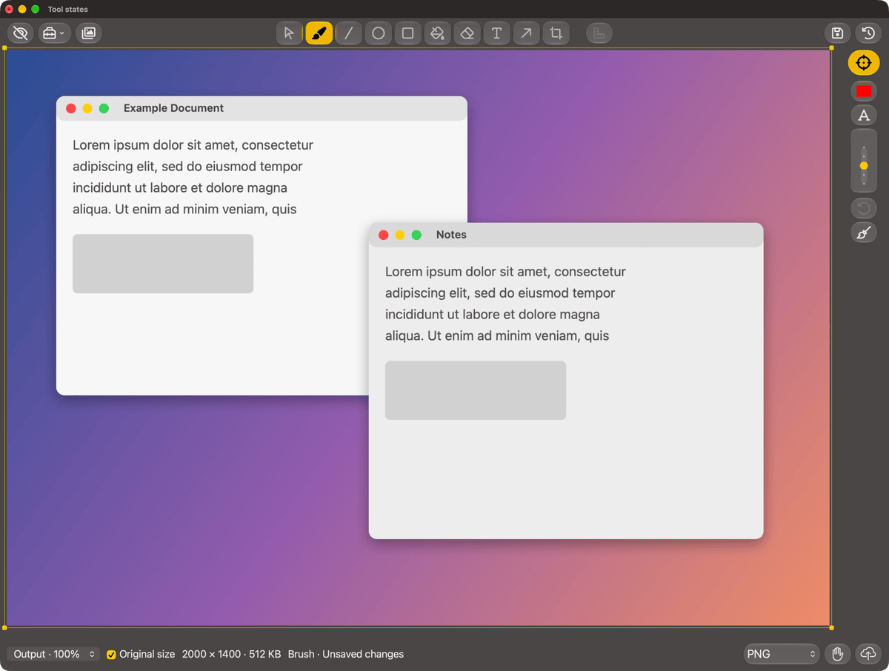</a> | Resize and Undo forced disabled. • Disabled controls differ from enabled ones only by a faded glyph; no label explains why they are unavailable. |
| **S04** tool states _Snap (primary, accent) hovered_ `280×360px · 140×180pt @2x · CGWindowListCreateImage` | <a href="S04-snap-hover-light.png">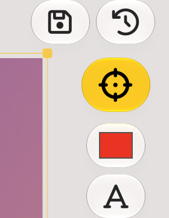</a> | <a href="S04-snap-hover-dark.png">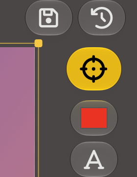</a> | Snap (primary) hovered. • Snap is already solid accent yellow, so the hover state is indistinguishable from rest. |
| **S04** tool states _arrow tool selected_ `3122×172px · 1561×86pt @2x · CGWindowListCreateImage` | <a href="S04-tool-arrow-light.png">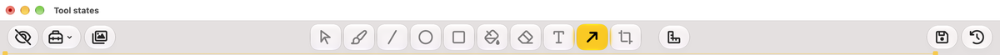</a> | <a href="S04-tool-arrow-dark.png">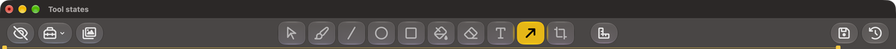</a> | Header crop with the arrow tool selected.  |
| **S04** tool states _brush tool selected_ `3122×172px · 1561×86pt @2x · CGWindowListCreateImage` | <a href="S04-tool-brush-light.png">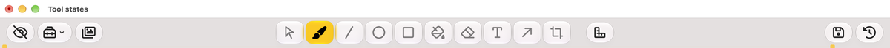</a> |  | Header crop with the brush tool selected. • Selected state is a solid yellow pill with a black glyph; all other tools are identical pale pills, so the only cue is colour. |
| **S04** tool states _crop tool selected_ `3122×172px · 1561×86pt @2x · CGWindowListCreateImage` | <a href="S04-tool-crop-light.png">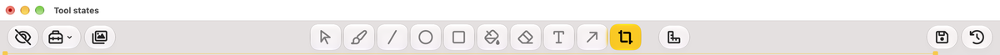</a> | <a href="S04-tool-crop-dark.png">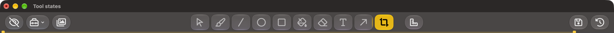</a> | Header crop with the crop tool selected.  |
| **S04** tool states _ellipse tool selected_ `3122×172px · 1561×86pt @2x · CGWindowListCreateImage` | <a href="S04-tool-ellipse-light.png">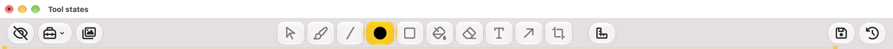</a> | <a href="S04-tool-ellipse-dark.png">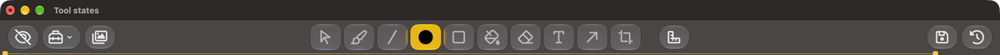</a> | Header crop with the ellipse tool selected.  |
| **S04** tool states _eraser tool selected_ `3122×172px · 1561×86pt @2x · CGWindowListCreateImage` | <a href="S04-tool-eraser-light.png">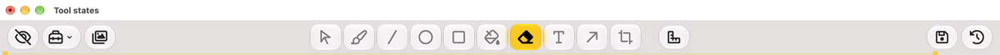</a> | <a href="S04-tool-eraser-dark.png">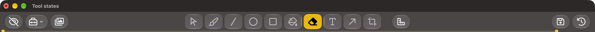</a> | Header crop with the eraser tool selected.  |
| **S04** tool states _fill tool selected_ `3122×172px · 1561×86pt @2x · CGWindowListCreateImage` | <a href="S04-tool-fill-light.png">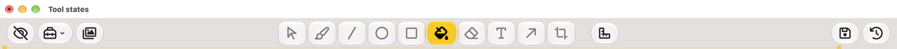</a> | <a href="S04-tool-fill-dark.png">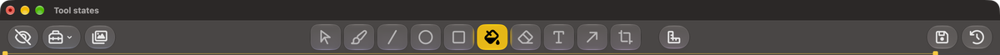</a> | Header crop with the fill tool selected.  |
| **S04** tool states _Rectangle tool hovered (GlassSurfaceView.setHovered), Brush selected_ `3122×172px · 1561×86pt @2x · CGWindowListCreateImage` | <a href="S04-tool-hover-light.png">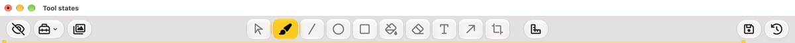</a> | <a href="S04-tool-hover-dark.png">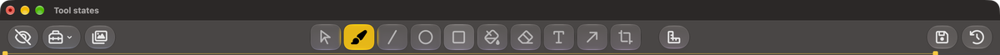</a> | Rectangle hovered via GlassSurfaceView.setHovered, Brush selected. • The hover tint on neutral glass is not visibly different from the resting pill in this capture. |
| **S04** tool states _line tool selected_ `3122×172px · 1561×86pt @2x · CGWindowListCreateImage` | <a href="S04-tool-line-light.png">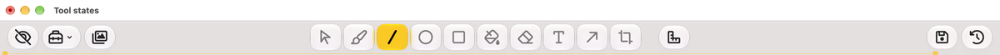</a> | <a href="S04-tool-line-dark.png">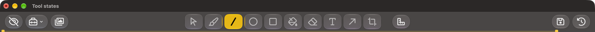</a> | Header crop with the line tool selected.  |
| **S04** tool states _Rectangle tool pressed (GlassSurfaceView.isPressed), Brush selected_ `3122×172px · 1561×86pt @2x · CGWindowListCreateImage` |  |  | Rectangle pressed via GlassSurfaceView.isPressed, Brush selected. • The pressed tint on neutral glass is barely visible next to unselected pills. |
| **S04** tool states _rectangle tool selected_ `3122×172px · 1561×86pt @2x · CGWindowListCreateImage` | <a href="S04-tool-rectangle-light.png">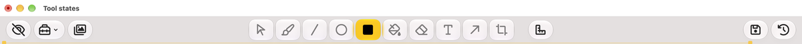</a> |  | Header crop with the rectangle tool selected.  |
| **S04** tool states _select tool selected_ `3122×172px · 1561×86pt @2x · CGWindowListCreateImage` | <a href="S04-tool-select-light.png">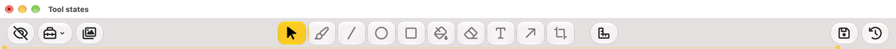</a> | <a href="S04-tool-select-dark.png">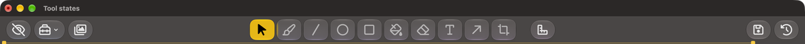</a> | Header crop with the select tool selected. • Selected state is a solid yellow pill with a black glyph; all other tools are identical pale pills, so the only cue is colour. |
| **S04** tool states _text tool selected_ `3122×172px · 1561×86pt @2x · CGWindowListCreateImage` | <a href="S04-tool-text-light.png">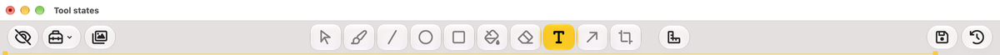</a> | <a href="S04-tool-text-dark.png">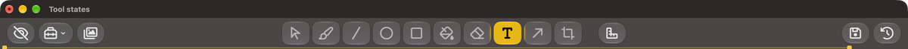</a> | Header crop with the text tool selected.  |
| **S05** selection handles _ellipse + arrow selected together_ `3122×2358px · 1561×1179pt @2x · CGWindowListCreateImage` | <a href="S05-selection-multi-light.png">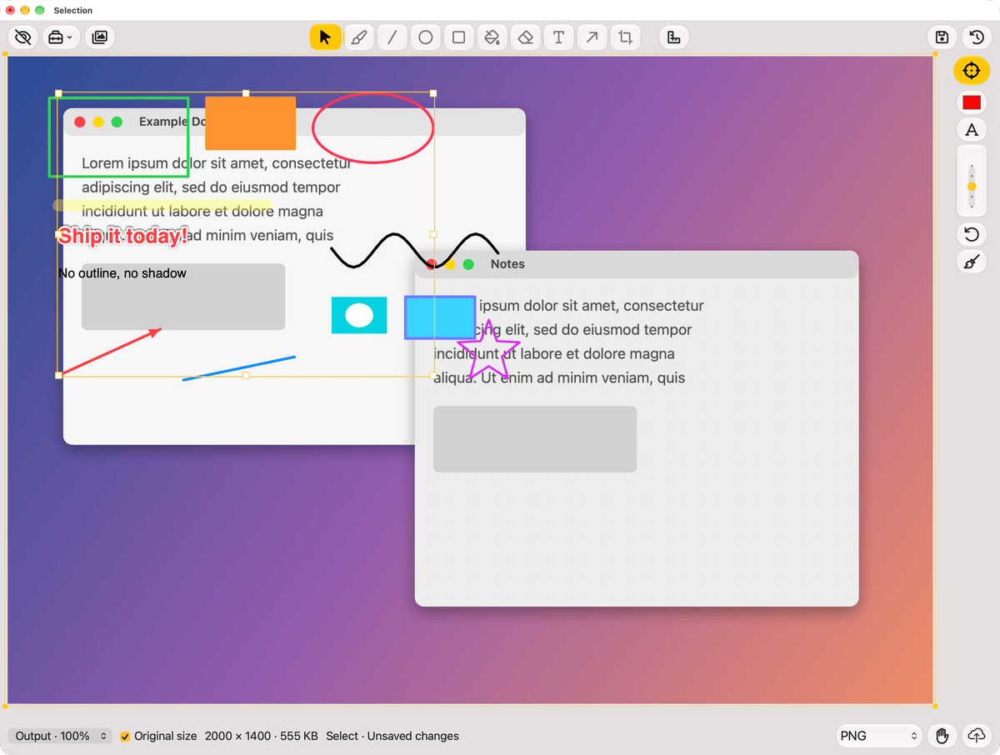</a> | <a href="S05-selection-multi-dark.png">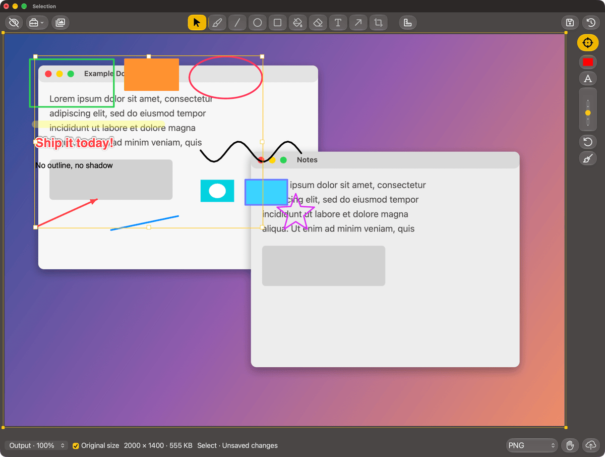</a> | Ellipse and arrow selected together. • Both elements share one large selection box; per-element handles are not shown. |
| **S05** selection handles _rectangle selected with resize handles_ `3122×2358px · 1561×1179pt @2x · CGWindowListCreateImage` |  | <a href="S05-selection-rect-dark.png">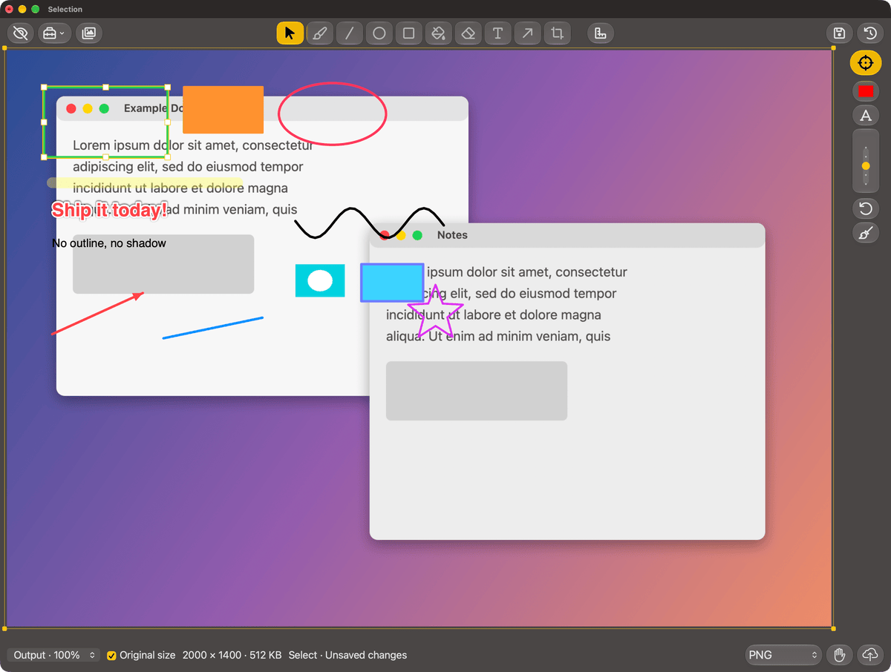</a> | Rectangle selected: dashed box with square handles at corners and edges. • Selection handles are small yellow squares with a pale outline, easy to lose against the yellow/white annotations. |
| **S05** text editing _text tool field editor active with typed text and grip_ `3122×2358px · 1561×1179pt @2x · CGWindowListCreateImage` |  | <a href="S05-text-editing-dark.png">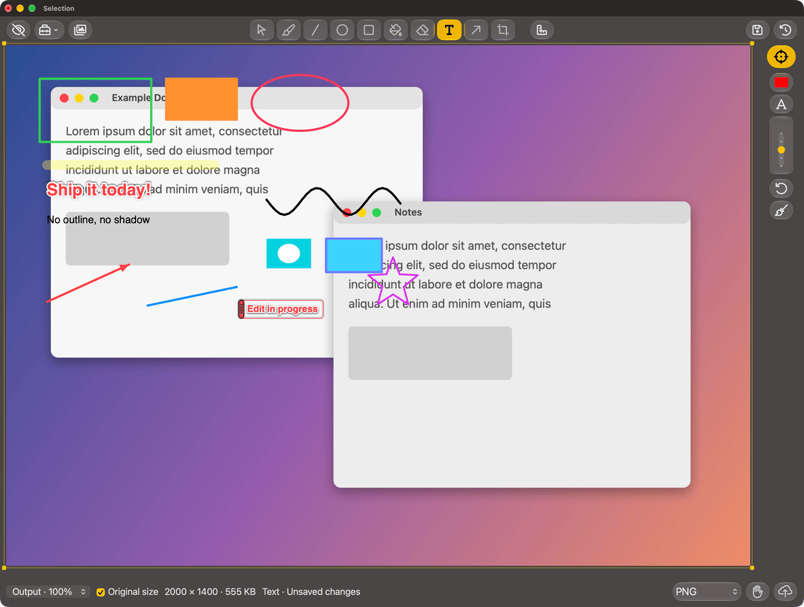</a> | Text tool field editor active with typed text and the move grip. • The editor shows a red outlined box plus a small pill grip at its left edge; the grip is a custom shape unlike any other control. |
| **S06** color picker _preset palette popover window alone_ `544×332px · 272×166pt @2x · CGWindowListCreateImage` | <a href="S06-color-palette-popover-light.png">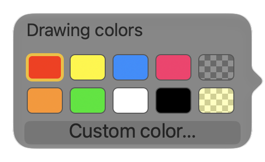</a> | <a href="S06-color-palette-popover-dark.png">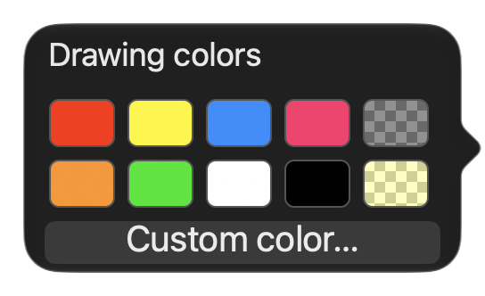</a> | Popover alone: 'Drawing colors' title, 2x5 swatches, full-width 'Custom color…'. • The popover is a heavy translucent grey with an arrow; 'Custom color…' is set larger than the 'Drawing colors' title. • Translucent gray and Highlighter are shown as checkerboards, the only swatches that look different in kind. |
| **S06** color picker _system NSColorPanel opened by Custom color…_ `532×908px · 266×454pt @2x · CGWindowListCreateImage` | <a href="S06-color-panel-light.png">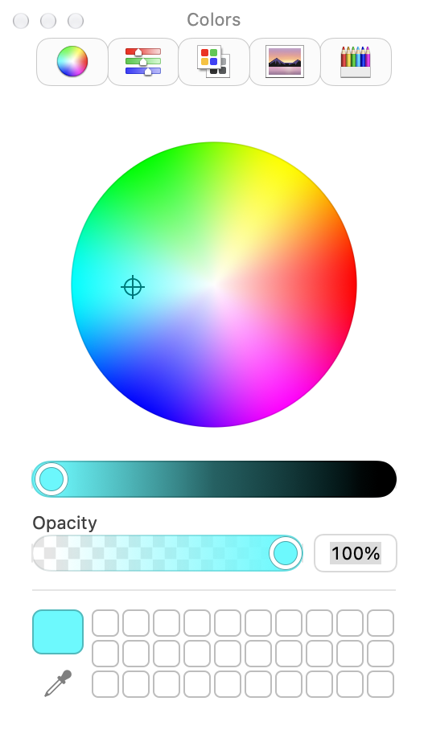</a> | <a href="S06-color-panel-dark.png">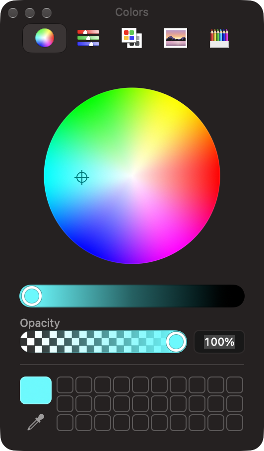</a> | System colour panel opened by Custom color…. • Panel labels such as 'Opacity' and the tab names measure 11 pt in the view tree: system-owned text under the 18 pt floor. |
| **S06** Fonts panel / text style form _NSFontPanel with Outline / Shadow / Default accessory form_ `1880×1440px · 940×720pt @2x · CGWindowListCreateImage` | <a href="S06-fonts-panel-light.png">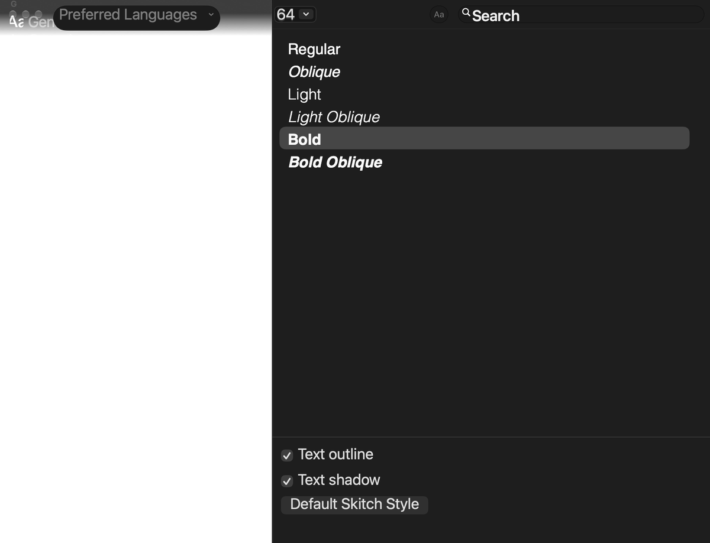</a> | <a href="S06-fonts-panel-dark.png">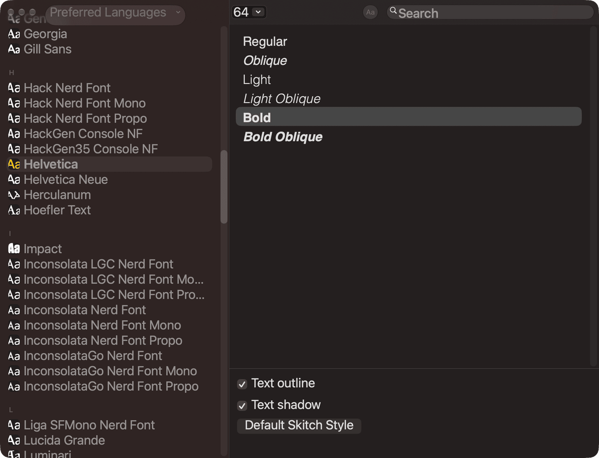</a> | Shared NSFontPanel with the Text outline / Text shadow / Default Skitch Style accessory. • The panel's left (collections/family) pane is captured blank white next to a dark right pane in both appearances; probably out-of-process rendering, treat as a capture limitation. • The accessory button reads 'Default Skitch Style' (Skitch wording). |
| **S06** size slider _size slider at 12.0 (max)_ `260×2098px · 130×1049pt @2x · CGWindowListCreateImage` |  |  | Right-rail crop with the size slider at its max position. • The slider knob moves but no number or preview of the stroke width is shown. |
| **S06** size slider _size slider at 6.75 (mid)_ `260×2098px · 130×1049pt @2x · CGWindowListCreateImage` | <a href="S06-size-mid-light.png">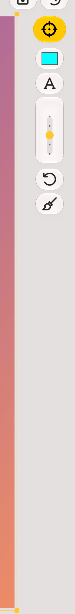</a> | <a href="S06-size-mid-dark.png">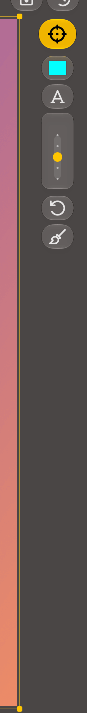</a> | Right-rail crop with the size slider at its mid position. • The slider knob moves but no number or preview of the stroke width is shown. |
| **S06** size slider _size slider at 1.5 (min)_ `260×2098px · 130×1049pt @2x · CGWindowListCreateImage` |  | <a href="S06-size-min-dark.png">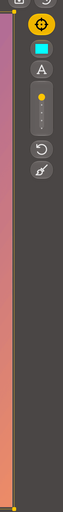</a> | Right-rail crop with the size slider at its min position. • The slider knob moves but no number or preview of the stroke width is shown. |
| **S07** canvas viewport _Actual Size on: navigator overview panel beside the window_ `3818×2358px · 1909×1179pt @2x · CGWindowListCreateImageFromArray` | <a href="S07-actual-size-light.png">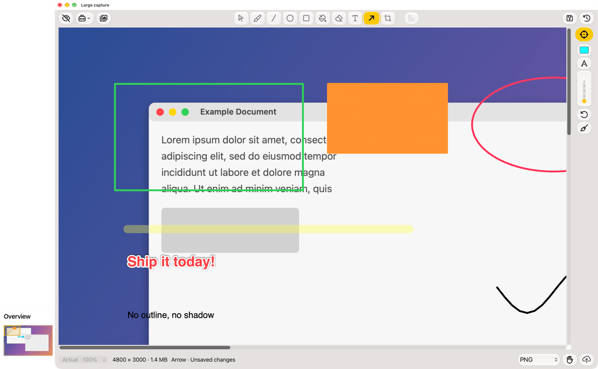</a> | <a href="S07-actual-size-dark.png">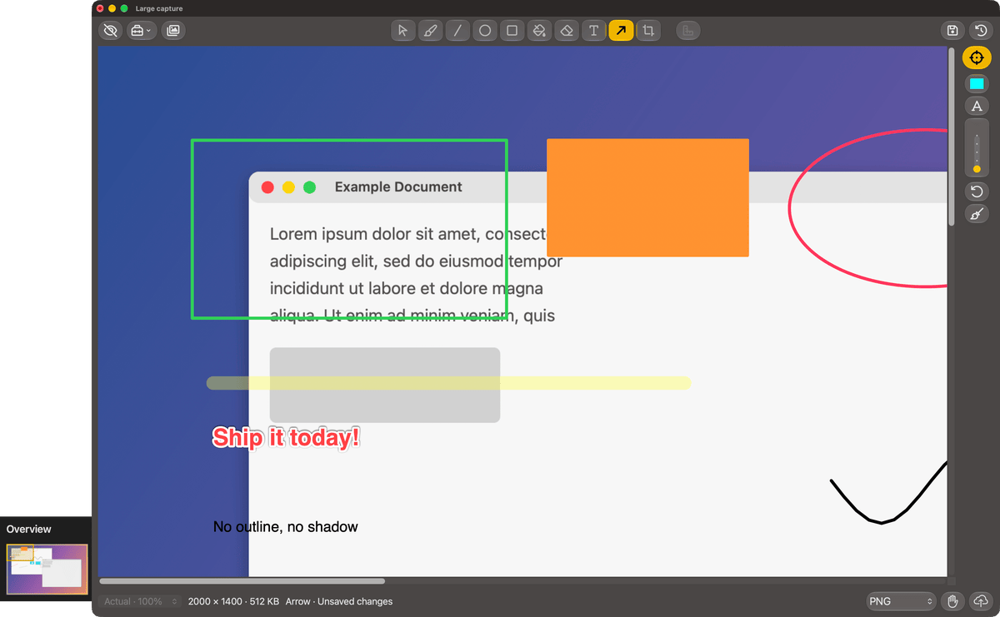</a> | Actual Size on: Overview navigator panel docked at the left of the window. • The navigator is a separate white panel with a black strip above it in the composite; it overlaps nothing but sits outside the window frame. • Resize and the zoom popup are greyed while Actual Size is on. |
| **S07** canvas viewport _2400x1500 image fitted into the window_ `3468×2358px · 1734×1179pt @2x · CGWindowListCreateImage` | <a href="S07-large-fit-light.png">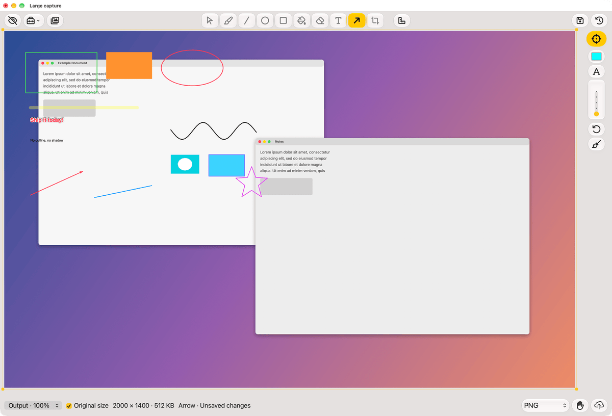</a> | <a href="S07-large-fit-dark.png">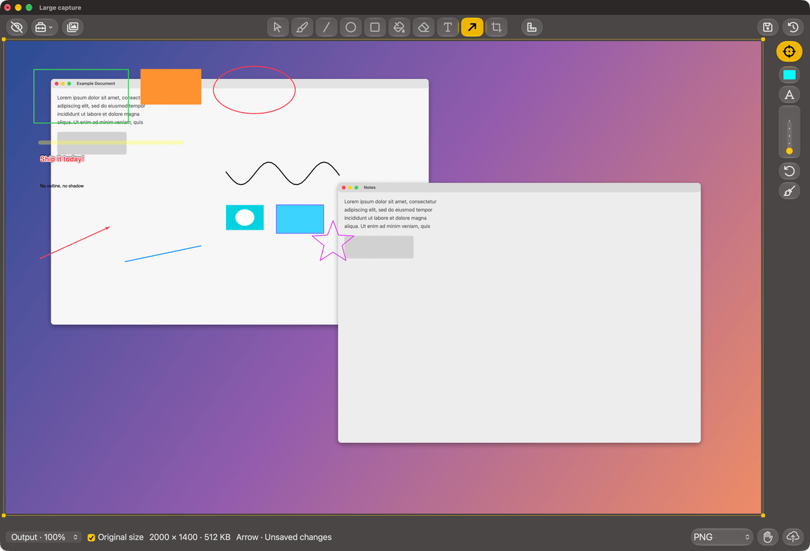</a> | 4800x3000-point synthetic image fitted to the window. • Right column: Snap, Color, Font, size slider, Undo and Wipe stop about 55% of the way down; the rest of that column is empty window-grey. |
| **S07** canvas viewport _360x240 image centred in a large viewport (CenteringClipView)_ `1960×1296px · 980×648pt @2x · CGWindowListCreateImage` | <a href="S07-small-centred-light.png">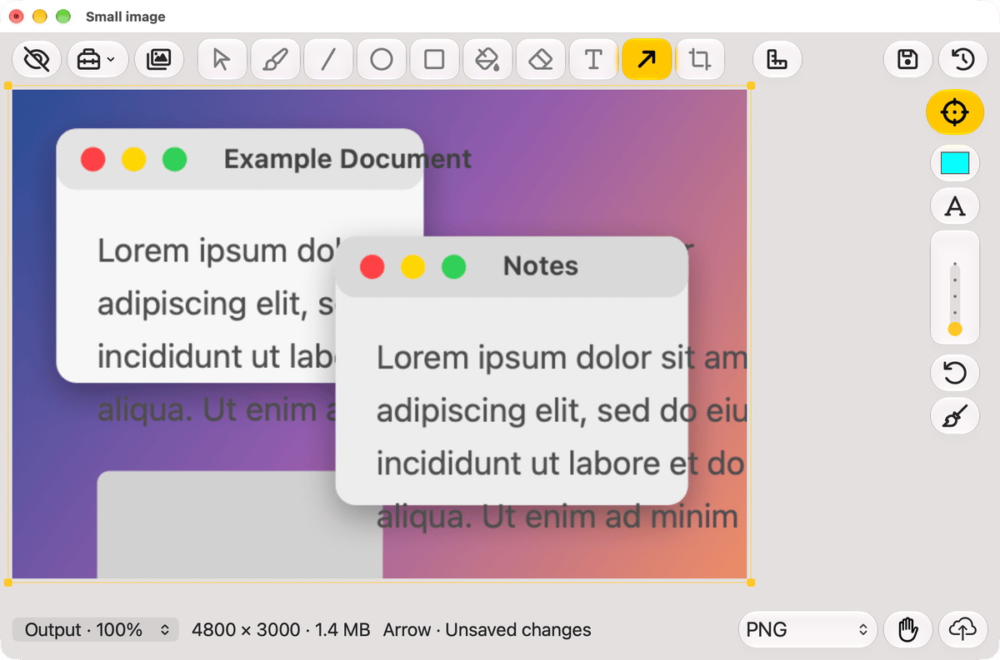</a> | <a href="S07-small-centred-dark.png">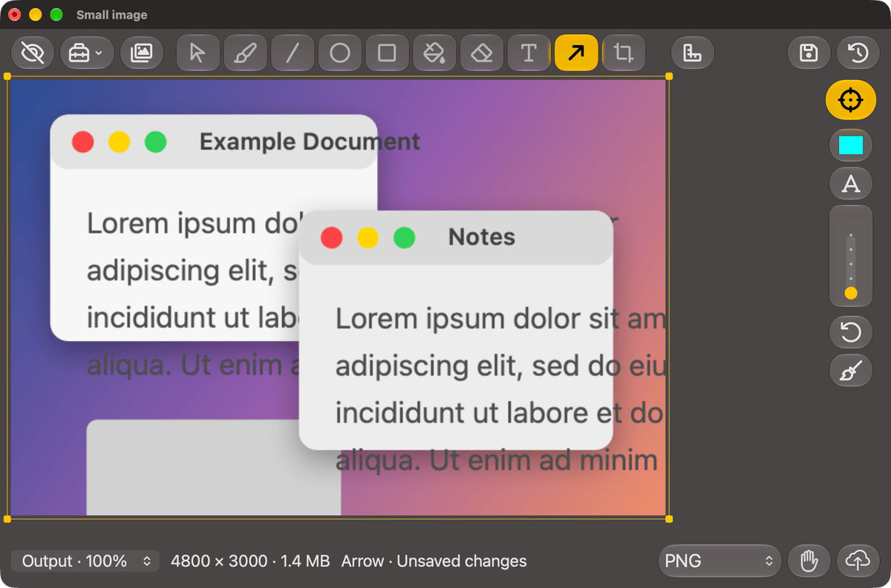</a> | 'Small image' fixture; the document had been inflated by the preceding Actual Size state, so this is NOT a valid small-image centring test. • Harness fixture flaw (fixed for the delta set by shooting this case first). |
| **S07** canvas viewport _zoom 200%_ `3468×2358px · 1734×1179pt @2x · CGWindowListCreateImage` |  | <a href="S07-zoom-200-dark.png">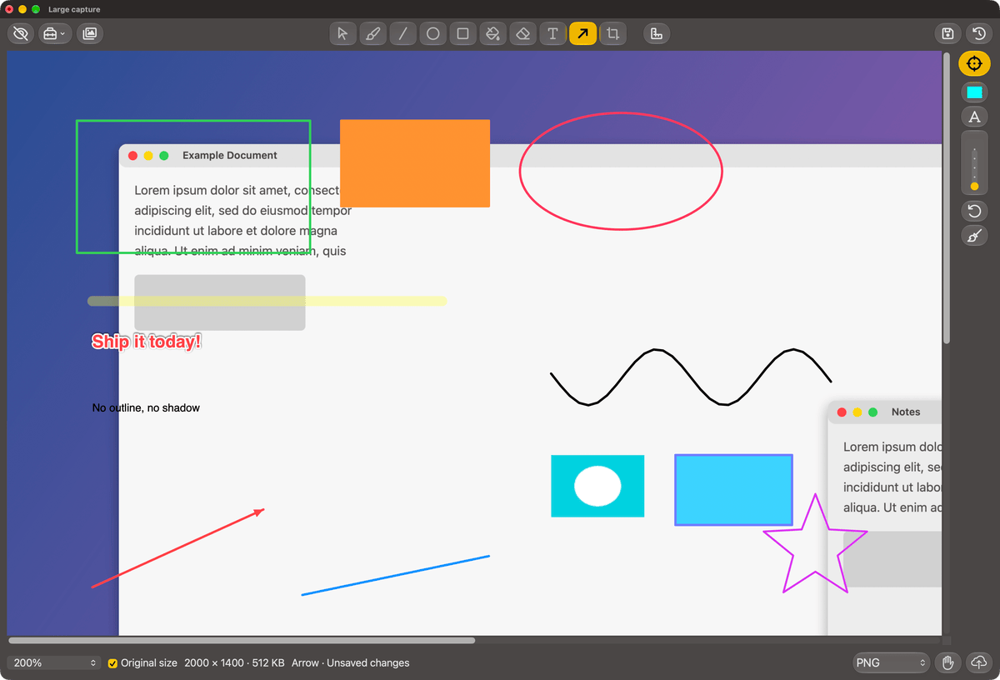</a> | Zoom 200%: image overflows, scroll bars appear. • A heavy dark vertical scroller appears at the right of the canvas, wider and darker than the rest of the chrome. |
| **S07** canvas viewport _zoom 25%_ `3468×2358px · 1734×1179pt @2x · CGWindowListCreateImage` | <a href="S07-zoom-25-light.png">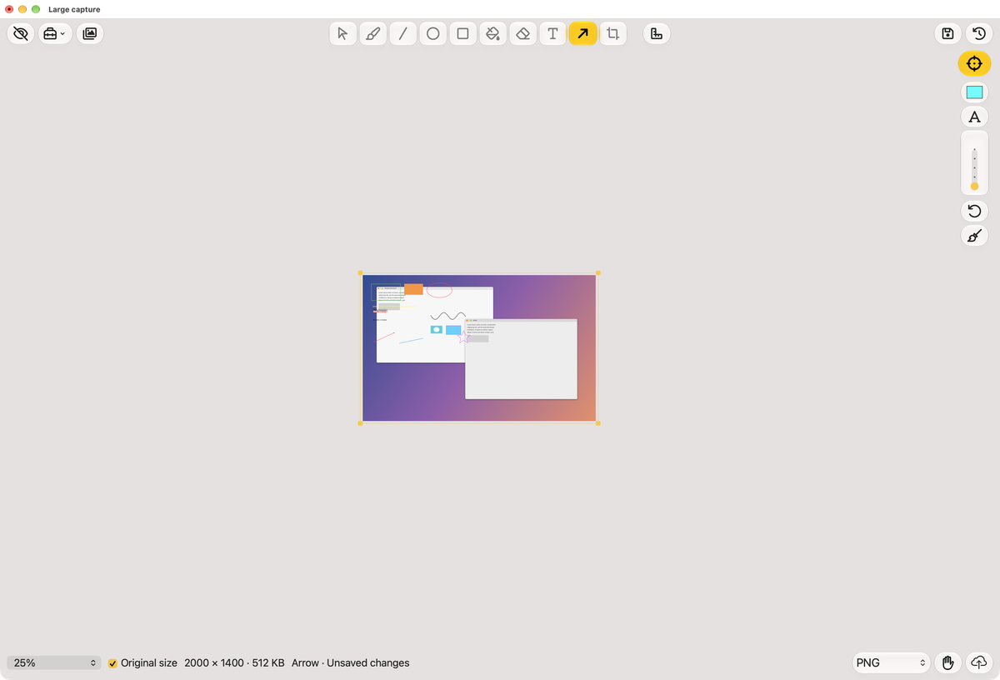</a> | <a href="S07-zoom-25-dark.png">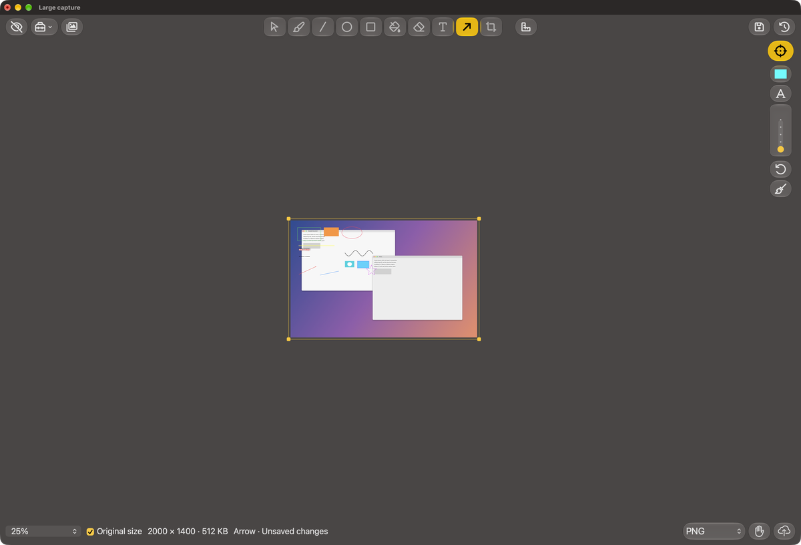</a> | Zoom 25%: small image floats in the middle of a large grey area. • The centred small image has no drop shadow or edge against the grey; it reads as a floating thumbnail. |
| **S07** canvas viewport _zoom 50%_ `3468×2358px · 1734×1179pt @2x · CGWindowListCreateImage` | <a href="S07-zoom-50-light.png"></a> | <a href="S07-zoom-50-dark.png"></a> | Zoom 50%.  |
| **S08** crop mode _crop tool with a 640x420 crop rectangle_ `3266×2358px · 1633×1179pt @2x · CGWindowListCreateImage` | <a href="S08-crop-mode-light.png"></a> | <a href="S08-crop-mode-dark.png"></a> | Crop tool with a dashed yellow crop rectangle; outside the crop the image is dimmed. • The dashed crop rectangle has no visible handles in this capture. |
| **S08** Resize panel _Resize sheet with built-in + two synthetic presets_ `1200×1300px · 600×650pt @2x · CGWindowListCreateImage` | <a href="S08-resize-panel-light.png"></a> | <a href="S08-resize-panel-dark.png"></a> | Resize sheet alone: 'Resize or Crop', preset popup, name, Add/Save/Remove, Resize\|Crop\|Limit, Width/Height, Lock proportions, Cancel/Apply/OK. • Width shows a fractional value ('1516.5') in a field labelled pixels. • Roughly a fifth of the sheet below 'Lock proportions' is empty before the buttons. • Save Preset and Remove are greyed with low contrast. |
| **S08** Resize panel _Resize sheet with built-in + two synthetic presets (parent window + sheet composite)_ `3266×2358px · 1633×1179pt @2x · CGWindowListCreateImageFromArray` | <a href="S08-resize-panel-in-context-light.png"></a> | <a href="S08-resize-panel-in-context-dark.png"></a> | Resize sheet composited over its (dimmed) parent window.  |
| **S09** footer _zoom, status, format, drag well, upload_ `3122×120px · 1561×60pt @2x · CGWindowListCreateImage` |  |  | Footer crop: zoom popup, Original size, size label, status, PNG popup, hand, upload. • The footer packs seven text and control elements in one row; the PNG popup and the two glass buttons are the only glass items. |
| **S09** footer _very long status text_ `3122×120px · 1561×60pt @2x · CGWindowListCreateImage` | <a href="S09-footer-long-status-light.png"></a> | <a href="S09-footer-long-status-dark.png"></a> | Footer with a very long status line. • The long status truncates with an ellipsis at the PNG popup edge instead of wrapping or tooltip-only disclosure. |
| **S09** footer _Upload (Webpost) destination menu open, no destination configured_ `3670×2492px · 1835×1246pt @2x · CGWindowListCreateImageFromArray` | — | <a href="S09-upload-menu-open-dark.png"></a> | Webpost destination menu open at the bottom right. • **dark:** The captured menu is clipped on its left side by the composite bounds (harness limitation); items read 'Destination Settings…' and 'Share with macOS…'. |
| **S10** export save panel _ExportAccessory view rendered in its own window (JPEG selected)_ `646×820px · 323×410pt @2x · CGWindowListCreateImage` | <a href="S10-export-accessory-alone-light.png"></a> | <a href="S10-export-accessory-alone-dark.png"></a> | ExportAccessory rendered in its own window (the real save panel is out of process and was not captured). • 'Dimensions: Not available / Encoded size: Not available' appear because the accessory was rendered stand-alone without the exporter callbacks (harness artifact). |
| **S11** window sizes _contentMinSize 980x608_ `1960×1280px · 980×640pt @2x · CGWindowListCreateImage` | <a href="S11-size-contentmin-light.png"></a> | <a href="S11-size-contentmin-dark.png"></a> | Window at contentMinSize. • A dark vertical scroller shows at the right of the canvas even though the 800x600 canvas nearly fits. |
| **S11** window sizes _default 1024x740_ `2048×1544px · 1024×772pt @2x · CGWindowListCreateImage` | <a href="S11-size-default-light.png"></a> |  | Default window 1024 wide. • Right column: Snap, Color, Font, size slider, Undo and Wipe stop about 55% of the way down; the rest of that column is empty window-grey. |
| **S11** window sizes _maximized to visibleFrame 2056x1197_ `4112×2394px · 2056×1197pt @2x · CGWindowListCreateImage` | <a href="S11-size-maximized-light.png"></a> | <a href="S11-size-maximized-dark.png"></a> | Maximised to the screen's visible frame. • The small canvas floats in a very large grey area and the empty rail column spans the full height. |
| **S11** window sizes _tall 1000x1157_ `2000×2314px · 1000×1157pt @2x · CGWindowListCreateImage` | <a href="S11-size-tall-light.png"></a> | <a href="S11-size-tall-dark.png"></a> | Tall window with the 800x600 canvas. • Large grey bands above and below the centred canvas; the rail stack stays at the top, leaving the lower rail column empty. |
| **S11** window sizes _wide 1900x640_ `3800×1280px · 1900×640pt @2x · CGWindowListCreateImage` | <a href="S11-size-wide-light.png"></a> | <a href="S11-size-wide-dark.png"></a> | Window about 1900 pt wide and 640 pt tall with the 800x600 canvas. • The canvas does not fit the 640 pt height, so a dark vertical scroller appears while wide grey margins surround the canvas left and right. • The rail stays pinned to the right edge, far from the header tools. |
| **S11** window sizes _window width 1024 pt, default height_ `2048×1544px · 1024×772pt @2x · CGWindowListCreateImage` |  |  | Window 1024 pt wide.  |
| **S11** window sizes _window width 1280 pt, default height_ `2560×1544px · 1280×772pt @2x · CGWindowListCreateImage` | <a href="S11-width-1280-light.png"></a> | <a href="S11-width-1280-dark.png"></a> | Window 1280 pt wide.  |
| **S11** window sizes _window width 1440 pt, default height_ `2880×1544px · 1440×772pt @2x · CGWindowListCreateImage` | <a href="S11-width-1440-light.png"></a> | <a href="S11-width-1440-dark.png"></a> | Window 1440 pt wide.  |
| **S11** window sizes _window width 980 pt, default height_ `1960×1544px · 980×772pt @2x · CGWindowListCreateImage` | <a href="S11-width-980-light.png"></a> | <a href="S11-width-980-dark.png"></a> | Window 980 pt wide. • At 980 pt the header has ~14 pt between the left group and the tool capsule; there is no spare room for another header control. |
| **S12** Frame mode _Frame mode: clear canvas hole, Snap Frame + Cancel, window alpha 0.8_ `3122×2358px · 1561×1179pt @2x · CGWindowListCreateImage` | <a href="S12-frame-mode-light.png"></a> | <a href="S12-frame-mode-dark.png"></a> | Frame mode: transparent canvas hole with yellow border, Snap becomes the frame glyph, Cancel (X) appears. • The canvas hole is bounded by a thin yellow line and a horizontal scroll bar overlaps its bottom edge. • The window is semi-transparent (alpha 0.8) so the title bar and rail look washed out. |
| **S12** Frame mode _Re-snap (keep pen) Frame mode over existing annotations_ `3122×2358px · 1561×1179pt @2x · CGWindowListCreateImage` |  | <a href="S12-frame-resnap-dark.png"></a> | Re-snap Frame mode over existing annotations. • Annotations are drawn pale/translucent inside the hole. |
| **S12** Frame mode _Frame mode at window width 1024 pt_ `2048×2358px · 1024×1179pt @2x · CGWindowListCreateImage` | <a href="S12-frame-w1024-light.png"></a> | <a href="S12-frame-w1024-dark.png"></a> | Frame mode at 1024 pt. • Status reads 'Frame: position the window, t…' truncated at 1024 pt. |
| **S12** Frame mode _Frame mode at window width 980 pt_ `1960×2358px · 980×1179pt @2x · CGWindowListCreateImage` |  | <a href="S12-frame-w980-dark.png"></a> | Frame mode at 980 pt. • Status reads 'Frame: position the win…' truncated at 980 pt. |
| **S13** capture picker / crosshair + magnifier _crosshair overlay with magnifier (lens grey, as without a Screen Recording grant), no drag yet_ `4112×2658px · 2056×1329pt @2x · CGWindowListCreateImage` |  | <a href="S13-picker-no-recording-grant-dark.png"></a> | Crosshair overlay with the magnifier lens grey (no Screen Recording grant). • Without pixels the lens is a flat grey square with a tiny '1028x664' coordinate label. |
| **S13** capture picker / crosshair + magnifier _mid-drag selection rectangle with dimmed surround (lens grey)_ `4112×2658px · 2056×1329pt @2x · CGWindowListCreateImage` |  | <a href="S13-picker-no-recording-grant-dragging-dark.png"></a> | Mid-drag selection with dimmed surround. • The size badge '499x300px' is a small grey tag at the selection corner; text is small. |
| **S13** capture picker / crosshair + magnifier _crosshair overlay with magnifier (lens fed synthetic pixels), no drag yet_ `4112×2658px · 2056×1329pt @2x · CGWindowListCreateImage` | <a href="S13-picker-synthetic-lens-light.png"></a> |  | Overlay with synthetic pixels in the lens.  |
| **S13** capture picker / crosshair + magnifier _mid-drag selection rectangle with dimmed surround (lens synthetic)_ `4112×2658px · 2056×1329pt @2x · CGWindowListCreateImage` | <a href="S13-picker-synthetic-lens-dragging-light.png"></a> |  | Mid-drag selection, lens showing synthetic purple pixels. • The coordinate label '1028x664' sits across the lens's lower edge and is partly covered by the lens. |
| **S14** countdown overlay _countdown digit 1 (tick 42)_ `276×280px · 138×140pt @2x · CGWindowListCreateImage` |  |  | Capture countdown digit 1. • Original Skitch artwork: a grey circular badge with a white digit and a pie sweep; the digit images are bundled originals. |
| **S14** countdown overlay _countdown digit 2 (tick 22)_ `276×280px · 138×140pt @2x · CGWindowListCreateImage` |  | <a href="S14-countdown-2-dark.png"></a> | Capture countdown digit 2. • Original Skitch artwork: a grey circular badge with a white digit and a pie sweep; the digit images are bundled originals. |
| **S14** countdown overlay _countdown digit 3 (tick 2)_ `276×280px · 138×140pt @2x · CGWindowListCreateImage` |  | <a href="S14-countdown-3-dark.png"></a> | Capture countdown digit 3. • Original Skitch artwork: a grey circular badge with a white digit and a pie sweep; the digit images are bundled originals. |
| **S15** capture flash _flash panel at full alpha over the editor frame (pure white fill)_ `3122×2358px · 1561×1179pt @2x · CGWindowListCreateImage` |  |  | Flash panel at full alpha (pure white).  |
| **S16** Screen Recording permission alert _the alert Capture.swift raises when Screen Recording is missing (built in-process; TCC never asked)_ `520×512px · 260×256pt @2x · cacheDisplay ` | <a href="S16-permission-alert-light.png"></a> | <a href="S16-permission-alert-dark.png"></a> | The Screen Recording alert built in-process. • The alert offers only 'OK'; there is no button to open System Settings. • Warning triangle plus camera badge, and the text says 'this app' rather than naming OpenSkitch. |
| **S17** Preferences: General _alternate values selected (Loose, Start, Menu bar, Classic appearance radio)_ `1600×1204px · 800×602pt @2x · CGWindowListCreateImage` | <a href="S17-preferences-alt-values-light.png"></a> | <a href="S17-preferences-alt-values-dark.png"></a> | Preferences with alternate values selected.  |
| **S17** Preferences: General _General preferences window (single page)_ `1600×1204px · 800×602pt @2x · CGWindowListCreateImage` | <a href="S17-preferences-general-light.png"></a> | <a href="S17-preferences-general-dark.png"></a> | Preferences window (tabs General / Drawing / Snapping). • 'Show Skitch in:' uses the old brand name. • An 'Appearance: Modern / Classic' row and 'Relaunch OpenSkitch' button are present at this baseline. • The window is shown inactive (grey traffic lights) in Light; the lower third of the pane is empty. |
| **S18** Preferences: Hotkeys _Capture Shortcuts sheet (all actions None)_ `1880×1320px · 940×660pt @2x · CGWindowListCreateImage` | <a href="S18-hotkeys-sheet-light.png"></a> | <a href="S18-hotkeys-sheet-dark.png"></a> | Global Capture Shortcuts sheet alone: 6 actions, all None, modifier checkboxes disabled. • Disabled modifier checkboxes (Command/Option/Control/Shift) are very pale grey and hard to read. • The row label 'Show Skitch' uses the old brand name. • Explanatory paragraphs run at the same size as the controls. |
| **S18** Preferences: Hotkeys _Capture Shortcuts sheet (all actions None) (parent window + sheet composite)_ `2048×2358px · 1024×1179pt @2x · CGWindowListCreateImageFromArray` | <a href="S18-hotkeys-sheet-in-context-light.png"></a> |  | The same sheet composited with its parent.  |
| **S19** Destinations / Publishing _edit form for the selected destination_ `1640×1720px · 820×860pt @2x · CGWindowListCreateImage` | <a href="S19-destinations-edit-form-light.png"></a> | <a href="S19-destinations-edit-form-dark.png"></a> | Edit form for Example S3. • The label 'Endpoint (blank = AWS)' wraps to two lines. • The Protocol and Credentials popups are narrower than the text fields above and below them. • About a quarter of the sheet below the buttons is blank. |
| **S19** Destinations / Publishing _edit form for the selected destination (parent window + sheet composite)_ `2048×2358px · 1024×1179pt @2x · CGWindowListCreateImageFromArray` |  | <a href="S19-destinations-edit-form-in-context-dark.png"></a> | Destinations sheet (edit-form) composited over its parent.  |
| **S19** Destinations / Publishing _Upload Destinations sheet, no destination saved_ `1640×1720px · 820×860pt @2x · CGWindowListCreateImage` | <a href="S19-destinations-empty-light.png"></a> | <a href="S19-destinations-empty-dark.png"></a> | Upload Destinations sheet with nothing saved. • A large empty list area and a 'Done' button far below it. |
| **S19** Destinations / Publishing _Upload Destinations sheet, no destination saved (parent window + sheet composite)_ `2048×2358px · 1024×1179pt @2x · CGWindowListCreateImageFromArray` |  |  | Destinations sheet (empty) composited over its parent.  |
| **S19** Preferences text field focus _first visible text field focused in the destination edit form_ `1640×1720px · 820×860pt @2x · CGWindowListCreateImage` | <a href="S19-destinations-form-focus-light.png"></a> | <a href="S19-destinations-form-focus-dark.png"></a> | Edit form with the first field focused.  |
| **S19** Preferences text field focus _first visible text field focused in the destination edit form (parent window + sheet composite)_ `2048×2358px · 1024×1179pt @2x · CGWindowListCreateImageFromArray` |  |  | Destinations sheet (form-focus) composited over its parent.  |
| **S19** Destinations / Publishing _three synthetic destinations (Example S3 default, SFTP, WebDAV)_ `1640×1720px · 820×860pt @2x · CGWindowListCreateImage` | <a href="S19-destinations-list-light.png"></a> | <a href="S19-destinations-list-dark.png"></a> | Three synthetic destinations; Example S3 marked (Default). • Rows read 'Example S3 · S3 (Default)': the protocol name repeats the destination name. • Edit…, Remove and Make Default are greyed until a row is selected, with low contrast. • Over half of the sheet below the buttons is blank. |
| **S19** Destinations / Publishing _three synthetic destinations (Example S3 default, SFTP, WebDAV) (parent window + sheet composite)_ `2048×2358px · 1024×1179pt @2x · CGWindowListCreateImageFromArray` |  |  | Destinations sheet (list) composited over its parent.  |
| **S20** History browser _History window with no entries_ `2360×1864px · 1180×932pt @2x · CGWindowListCreateImage` | <a href="S20-history-empty-light.png"></a> | <a href="S20-history-empty-dark.png"></a> | History window with no entries. • Metadata labels (Name/Date/Size/Action/Destination) sit in a centred block with a large empty gap to their left. |
| **S20** History browser _six synthetic entries across dates and actions (Saved/Exported/Shared)_ `2360×1864px · 1180×932pt @2x · CGWindowListCreateImage` | <a href="S20-history-populated-light.png"></a> | <a href="S20-history-populated-dark.png"></a> | Six synthetic entries across dates. • One 330-pt-wide thumbnail per section row leaves most of the window width empty. • Action buttons (Open, Copy, Copy Link…) are all disabled with no selection and low contrast. • The window is shown inactive (grey traffic lights). |
| **S20** History browser _one entry selected (action buttons enabled)_ `2360×1864px · 1180×932pt @2x · CGWindowListCreateImage` | <a href="S20-history-selected-light.png"></a> | <a href="S20-history-selected-dark.png"></a> | One entry selected.  |
| **S21** publish error _error alert after a stubbed failed upload_ `520×416px · 260×208pt @2x · cacheDisplay ` | — | <a href="S21-publish-error-dark.png"></a> | Error alert after a stubbed failed upload. • **dark:** Large warning triangle with app-icon badge; message text is bold with no secondary line; single OK button. |
| **S21** publish error _footer crop after the error alert was dismissed_ `3122×120px · 1561×60pt @2x · CGWindowListCreateImage` | <a href="S21-publish-error-footer-light.png"></a> | <a href="S21-publish-error-footer-dark.png"></a> | Footer after the error alert.  |
| **S21** publish progress _Uploading… status in footer while the stub uploader waits_ `3122×2358px · 1561×1179pt @2x · CGWindowListCreateImage` | <a href="S21-publish-progress-light.png"></a> |  | Upload in progress (stub uploader).  |
| **S21** publish progress _footer crop during upload_ `3122×120px · 1561×60pt @2x · CGWindowListCreateImage` | <a href="S21-publish-progress-footer-light.png"></a> | <a href="S21-publish-progress-footer-dark.png"></a> | Footer during upload.  |
| **S21** publish success _status after a stubbed successful upload_ `3122×2358px · 1561×1179pt @2x · CGWindowListCreateImage` |  | <a href="S21-publish-success-dark.png"></a> | Status after a stubbed success. • The status reads 'Link copied: https://cdn.example.com/pics/Upload-demo-<uuid>.png'; the long URL is cut off by an ellipsis before the format control. |
| **S21** publish success _footer crop after success_ `3122×120px · 1561×60pt @2x · CGWindowListCreateImage` | <a href="S21-publish-success-footer-light.png"></a> | <a href="S21-publish-success-footer-dark.png"></a> | Footer after success. • The 'Link copied: https://cdn.example.com/pics/…' status is truncated at the format control, so the file name is not visible. |
| **S21** publish progress _destination menu while an upload runs (Cancel Upload offered)_ `3638×2492px · 1819×1246pt @2x · CGWindowListCreateImageFromArray` | <a href="S21-upload-menu-busy-light.png"></a> | <a href="S21-upload-menu-busy-dark.png"></a> | Destination menu while uploading. • The menu is clipped on its left in the composite (harness limitation); it lists Cancel Upload, three destinations, Destination Settings…, Share with macOS…. |
| **S21** publish error _error alert after a stubbed failed upload (captured by the unexpected-modal guard)_ `520×416px · 260×208pt @2x · cacheDisplay ` | <a href="ZZ-unexpected-modal-1-light.png"></a> | <a href="ZZ-unexpected-modal-1-dark.png"></a> | Error alert after a stubbed failed upload. • **light:** Large warning triangle with app-icon badge; message text is bold with no secondary line; single OK button. • **dark:** Its buttons use smaller text than the other alerts' buttons. |
| **S24** status-bar item _menu-bar icon, highlighted_ `82×44px · 41×22pt @2x · NSView.cacheDisplay ` |  |  | Highlighted status button. • The highlighted icon is nearly identical to the normal one in this render. |
| **S24** status-bar item _menu-bar icon, normal (the button view only; the real bar is not captured)_ `82×44px · 41×22pt @2x · NSView.cacheDisplay ` | <a href="S24-statusitem-normal-light.png"></a> | <a href="S24-statusitem-normal-dark.png"></a> | Menu-bar button view: the original Skitch menu icon with a disclosure triangle. • Original Skitch artwork, a low-resolution bitmap that looks blurry at 2x. |
| **S25** About panel _standard About panel with OpenSkitch credits_ `568×440px · 284×220pt @2x · CGWindowListCreateImage` |  |  | Standard About panel. • Credits read 'Native 64-bit reconstruction for personal use. Feature parity with Skitch 1.0.12 is still in progress.' (Skitch branding). • Traffic lights are grey and the panel is plain; no link, licence or website. |
| **S26** alerts / sheets _Save your drawing? (Save / Cancel / Discard)_ `520×572px · 260×286pt @2x · cacheDisplay ` | — | <a href="S26-close-unsaved-dark.png"></a> | Save your drawing? alert. • **dark:** The three buttons are stacked full width with the destructive 'Discard' between 'Save' and 'Cancel'. |
| **S26** alerts / sheets _generic NSAlert(error:) alert_ `520×384px · 260×192pt @2x · cacheDisplay ` | <a href="S26-error-generic-light.png"></a> | <a href="S26-error-generic-dark.png"></a> | Generic NSAlert(error:). • Warning triangle with app badge for a non-warning message. |
| **S26** alerts / sheets _Hide drawings from History?_ `520×468px · 260×234pt @2x · cacheDisplay ` | <a href="S26-history-hide-light.png"></a> | — | Hide drawings from History? alert.  |
| **S26** alerts / sheets _Move archived drawings to Trash?_ `520×600px · 260×300pt @2x · cacheDisplay ` | — | <a href="S26-history-trash-dark.png"></a> | Move archived drawings to Trash? alert. • **dark:** Alert title wraps to two lines; the primary 'Move to Trash' button is yellow like a safe action. |
| **S26** alerts / sheets _Remove “Example S3”? confirmation (default destination)_ `520×532px · 260×266pt @2x · cacheDisplay ` | <a href="S26-remove-destination-light.png"></a> | — | Remove “Example S3”? alert. • Four-line explanatory text; 'Remove' is yellow primary though destructive. |
| **S26** alerts / sheets _Rename… alert with text field_ `744×500px · 372×250pt @2x · cacheDisplay ` | <a href="S26-rename-light.png"></a> | — | Rename… alert with a name field. • Its buttons use smaller text than the other alerts' buttons. |
| **S26** alerts / sheets _Hide drawings from History? alert (captured by the unexpected-modal guard)_ `520×468px · 260×234pt @2x · cacheDisplay ` | <a href="ZZ-unexpected-modal-2-light.png"></a> | <a href="ZZ-unexpected-modal-2-dark.png"></a> | Hide drawings from History? alert. • **light:** The three buttons are stacked full width with the destructive 'Discard' between 'Save' and 'Cancel'. |
| **S26** alerts / sheets _Remove destination confirmation (captured by the unexpected-modal guard)_ `520×532px · 260×266pt @2x · cacheDisplay ` | <a href="ZZ-unexpected-modal-3-light.png"></a> | <a href="ZZ-unexpected-modal-3-dark.png"></a> | Remove “Example S3”? alert. • **light:** Alert title wraps to two lines; the primary 'Move to Trash' button is yellow like a safe action. • **dark:** Four-line explanatory text; 'Remove' is yellow primary though destructive. |
| **S27** first launch / welcome document _empty support dir: bundled welcome document_ `2048×1544px · 1024×772pt @2x · CGWindowListCreateImage` | <a href="S27-first-launch-welcome-light.png"></a> | <a href="S27-first-launch-welcome-dark.png"></a> | App opened with an empty support folder: the bundled welcome document. • Original Skitch welcome artwork ('Snap your screen' with an arrow) is shown on a small white canvas. • Title reads 'Welcome'; zoom reads 'Fit · 100%'. |
| **S28** keyboard focus _Format popup is first responder_ `3122×120px · 1561×60pt @2x · CGWindowListCreateImage` | <a href="S28-focus-footer-format-light.png"></a> | <a href="S28-focus-footer-format-dark.png"></a> | Format popup focused.  |
| **S28** keyboard focus _Upload button is first responder_ `3122×120px · 1561×60pt @2x · CGWindowListCreateImage` | <a href="S28-focus-footer-upload-light.png"></a> |  | Upload button focused.  |
| **S28** keyboard focus _Zoom popup is first responder_ `3122×120px · 1561×60pt @2x · CGWindowListCreateImage` | <a href="S28-focus-footer-zoom-light.png"></a> |  | Zoom popup focused. • A pale-yellow ring around the popup, low contrast on the grey footer. |
| **S28** keyboard focus _Snap (primary) is first responder_ `280×400px · 140×200pt @2x · CGWindowListCreateImage` | <a href="S28-focus-rail-snap-light.png"></a> | <a href="S28-focus-rail-snap-dark.png"></a> | Snap focused (crop of the rail).  |
| **S28** keyboard focus _Hide button is first responder_ `3122×172px · 1561×86pt @2x · CGWindowListCreateImage` |  | <a href="S28-focus-topbar-hide-dark.png"></a> | Hide button focused. • Thin pale-yellow ring around the pill; low contrast. |
| **S28** keyboard focus _Brush tool button is first responder (focus ring)_ `3122×172px · 1561×86pt @2x · CGWindowListCreateImage` | <a href="S28-focus-topbar-tool-light.png"></a> | <a href="S28-focus-topbar-tool-dark.png"></a> | Brush tool button focused. • The focus ring is a thin pale-yellow outline, faint against the pale glass. |
| **S29** drag-out thumbnail _Drag Me thumbnail panel after the editor shrinks (Skitch_Cancel_DragMe hover art absent: not hovering)_ `256×196px · 128×98pt @2x · CGWindowListCreateImage` |  | <a href="S29-drag-thumbnail-dark.png"></a> | Editor shrunk into the drag thumbnail panel. • The thumbnail is a screenshot of the whole editor, so all chrome appears as tiny unreadable detail. |
| **S29** drag-out thumbnail _clickToExpand overlay (original Skitch_ShowSkitch artwork)_ `256×196px · 128×98pt @2x · CGWindowListCreateImage` | <a href="S29-drag-thumbnail-expand-light.png"></a> | <a href="S29-drag-thumbnail-expand-dark.png"></a> | Thumbnail with the click-to-expand overlay. • Original Skitch artwork: a large grey 'Show Skitch' plate with corner triangles covers most of the thumbnail. |
| **S29** help bevel (tool-tip overlay) _OriginalHelpBevel HUD with a hover hint (feature is off by default)_ `3122×2376px · 1561×1188pt @2x · CGWindowListCreateImageFromArray` |  |  | Help bevel HUD forced on.  |

## PROTOTYPE MOCKS — NOT PRODUCT (source `dc1eb26`, harness-only re-parenting)

> **PROTOTYPE MOCKS — these are NOT product.** They are built inside the audit process by re-parenting the live controls into a rail-less layout (stroke-width pill is a mock horizontal slider; Original size checkbox and size label are hidden). They exist only to test fit.

| Capture | Light | Dark | Directly observed (this capture) |
|---|---|---|---|
| **PROTO** PROTOTYPE MOCK (not product): rail-less layout _mock at window width 1280, Frame mode_ `2560×1544px · 1280×772pt @2x · CGWindowListCreateImage` | <a href="PROTO-w1280-frame-light@dc1eb26.png"></a> | <a href="PROTO-w1280-frame-dark@dc1eb26.png"></a> | PROTOTYPE MOCK (not product). Mock at 1280 pt in Frame mode. • Top row has about 238 pt free with Cancel shown. |
| **PROTO** PROTOTYPE MOCK (not product): rail-less layout _mock at window width 1280, normal_ `2560×1544px · 1280×772pt @2x · CGWindowListCreateImage` | <a href="PROTO-w1280-normal-light@dc1eb26.png"></a> | <a href="PROTO-w1280-normal-dark@dc1eb26.png"></a> | PROTOTYPE MOCK (not product). Mock at 1280 pt. • Top row has about 292 pt of free space; bottom row about 515 pt (status can show its full text). |
| **PROTO** PROTOTYPE MOCK (not product): rail-less layout _mock at window width 980, Frame mode_ `2084×1544px · 1042×772pt @2x · CGWindowListCreateImage` | <a href="PROTO-w980-frame-light@dc1eb26.png"></a> | <a href="PROTO-w980-frame-dark@dc1eb26.png"></a> | PROTOTYPE MOCK (not product). Same mock in Frame mode: Cancel appears beside Snap. • Frame mode adds the Cancel pill (54 pt): the top row then needs 1042 pt of window, 62 pt more than 980; the window was pushed to 1042 pt wide. Overflowing element: the top row as a whole; Cancel is what tips it. |
| **PROTO** PROTOTYPE MOCK (not product): rail-less layout _mock at window width 980, normal_ `1976×1544px · 988×772pt @2x · CGWindowListCreateImage` | <a href="PROTO-w980-normal-light@dc1eb26.png"></a> | <a href="PROTO-w980-normal-dark@dc1eb26.png"></a> | PROTOTYPE MOCK (not product). Rail-less layout, requested width 980 (the window settled at 988 pt wide): top row Hide/Toolbox/Photos, Snap, ten 44-pt tools, Color, mock stroke-width slider, Font; bottom row Undo/Wipe, zoom, Resize, status, Save/History, PNG\|JPG, drag, upload; canvas runs to the trailing margin. • The top row needs 988 pt of window (964 pt of groups + 24 pt margins), 8 pt more than the 980 pt minimum: at a requested 980 pt the window was pushed to 988 pt. • Bottom row needs 740.5 pt plus status; the status gets about 223 pt, enough for 'Brush · Unsaved changes' (208 pt). |

## Captures at `dc1eb26`

| Capture | Light | Dark | Directly observed (this capture) |
|---|---|---|---|
| **S01** editor, empty _fresh blank canvas, default window_ `2048×1544px · 1024×772pt @2x · CGWindowListCreateImage` | <a href="S01-editor-empty-light@dc1eb26.png"></a> | <a href="S01-editor-empty-dark@dc1eb26.png"></a> | Blank 800x600 white canvas, centred; yellow corner handles; 10 tools + Resize in the glass header; Snap/Color/Font/size/Undo/Wipe stacked on the right; zoom, size, status, PNG popup, hand and upload in the footer. • Right column: Snap, Color, Font, size slider, Undo and Wipe stop about 55% of the way down; the rest of that column is empty window-grey. • Wipe is greyed out on the blank canvas; its disabled state differs from enabled only by a fainter glyph. • The zoom popup is a flat grey rounded rectangle while every other control is a white glass pill. • A thin yellow outline with square yellow corner handles surrounds the canvas, repeating the accent yellow already used on the selected tool and Snap. |
| **S02** editor, populated _synthetic 1200x800 background + arrow, line, rectangle (open+filled), ellipse, brush, highlighter, fill, text (outline+shadow, plain), SVG path, raster_ `3266×2358px · 1633×1179pt @2x · CGWindowListCreateImage` |  | <a href="S02-populated-dark@dc1eb26.png"></a> | 1200x800 synthetic background with all annotation kinds drawn over it; rail unchanged. • Right column: Snap, Color, Font, size slider, Undo and Wipe stop about 55% of the way down; the rest of that column is empty window-grey. • The highlighter stroke starts with a darker olive/grey round cap that does not match the pale yellow body. • Zoom label reads 'Output · 100%' and a checked 'Original size' box appears; both are jargon beside a plain footer. • Window title shows the document name but the text is small system title text (13 pt). |
| **S03** right rail _Snap, Color, Font, Size slider, Undo, Wipe_ `260×1040px · 130×520pt @2x · CGWindowListCreateImage` | <a href="S03-rail-light@dc1eb26.png"></a> | <a href="S03-rail-dark@dc1eb26.png"></a> | Right-rail crop: Snap, red colour swatch, 'A', vertical slider, Undo, Wipe. • The size slider is a tall vertical glass pill with tiny dots; its value is not visible anywhere. • Right column: Snap, Color, Font, size slider, Undo and Wipe stop about 55% of the way down; the rest of that column is empty window-grey. |
| **S03** title / top-bar chrome _logo-less glass header: Hide, Toolbox, Photos \| ten tools + Resize \| Save, History; title shows document name_ `3122×172px · 1561×86pt @2x · CGWindowListCreateImage` |  | <a href="S03-topbar-dark@dc1eb26.png"></a> | Header crop: eye-slash, briefcase menu, photos \| 10 tool glyphs + ruler \| save, history. • Every command is icon-only; the Hide glyph (eye with a slash) and the briefcase with a chevron do not say what they do. • Unselected tool glyphs are mid-grey on pale glass; selected Arrow is solid yellow with a black glyph, a much larger jump than the other tools make. • Resize (ruler corner) sits in the tool capsule but is a different kind of command from the ten tools. |
| **S05** selection handles _ellipse + arrow selected together_ `3122×2358px · 1561×1179pt @2x · CGWindowListCreateImage` | <a href="S05-selection-multi-light@dc1eb26.png"></a> |  | Ellipse and arrow selected together. • Both elements share one large selection box; per-element handles are not shown. |
| **S05** selection handles _rectangle selected with resize handles_ `3122×2358px · 1561×1179pt @2x · CGWindowListCreateImage` |  | <a href="S05-selection-rect-dark@dc1eb26.png"></a> | Rectangle selected: dashed box with square handles at corners and edges. • Selection handles are small yellow squares with a pale outline, easy to lose against the yellow/white annotations. |
| **S05** text editing _text tool field editor active with typed text and grip_ `3122×2358px · 1561×1179pt @2x · CGWindowListCreateImage` | <a href="S05-text-editing-light@dc1eb26.png"></a> | <a href="S05-text-editing-dark@dc1eb26.png"></a> | Text tool field editor active with typed text and the move grip. • The editor shows a red outlined box plus a small pill grip at its left edge; the grip is a custom shape unlike any other control. |
| **S07** canvas viewport _Actual Size on: navigator overview panel beside the window_ `3818×2358px · 1909×1179pt @2x · CGWindowListCreateImageFromArray` |  | <a href="S07-actual-size-dark@dc1eb26.png"></a> | Actual Size on: Overview navigator panel docked at the left of the window. • The navigator is a separate white panel with a black strip above it in the composite; it overlaps nothing but sits outside the window frame. • Resize and the zoom popup are greyed while Actual Size is on. |
| **S07** canvas viewport _2400x1500 image fitted into the window_ `3468×2358px · 1734×1179pt @2x · CGWindowListCreateImage` | <a href="S07-large-fit-light@dc1eb26.png"></a> | <a href="S07-large-fit-dark@dc1eb26.png"></a> | 4800x3000-point synthetic image fitted to the window. • Right column: Snap, Color, Font, size slider, Undo and Wipe stop about 55% of the way down; the rest of that column is empty window-grey. |
| **S07** canvas viewport _360x240 image centred in a large viewport (shot first, before any Actual Size state) (CenteringClipView)_ `1960×1296px · 980×648pt @2x · CGWindowListCreateImage` | <a href="S07-small-centred-light@dc1eb26.png"></a> | <a href="S07-small-centred-dark@dc1eb26.png"></a> | 'Small image' fixture; the document had been inflated by the preceding Actual Size state, so this is NOT a valid small-image centring test. • Harness fixture flaw (fixed for the delta set by shooting this case first). |
| **S07** canvas viewport _zoom 200%_ `3468×2358px · 1734×1179pt @2x · CGWindowListCreateImage` | <a href="S07-zoom-200-light@dc1eb26.png"></a> | <a href="S07-zoom-200-dark@dc1eb26.png"></a> | Zoom 200%: image overflows, scroll bars appear. • A heavy dark vertical scroller appears at the right of the canvas, wider and darker than the rest of the chrome. |
| **S07** canvas viewport _zoom 25%_ `3468×2358px · 1734×1179pt @2x · CGWindowListCreateImage` | <a href="S07-zoom-25-light@dc1eb26.png"></a> | <a href="S07-zoom-25-dark@dc1eb26.png"></a> | Zoom 25%: small image floats in the middle of a large grey area. • The centred small image has no drop shadow or edge against the grey; it reads as a floating thumbnail. |
| **S07** canvas viewport _zoom 50%_ `3468×2358px · 1734×1179pt @2x · CGWindowListCreateImage` | <a href="S07-zoom-50-light@dc1eb26.png"></a> | <a href="S07-zoom-50-dark@dc1eb26.png"></a> | Zoom 50%.  |
| **S09** footer _zoom, status, format, drag well, upload_ `3122×120px · 1561×60pt @2x · CGWindowListCreateImage` |  | <a href="S09-footer-dark@dc1eb26.png"></a> | Footer crop at dc1eb26: zoom popup, Original size, size label, status, PNG\|JPG toggle, hand, upload. • The zoom popup is still a flat grey rounded rectangle next to white glass pills. |
| **S09** footer _very long status text_ `3122×120px · 1561×60pt @2x · CGWindowListCreateImage` | <a href="S09-footer-long-status-light@dc1eb26.png"></a> | <a href="S09-footer-long-status-dark@dc1eb26.png"></a> | Long status line next to the wider PNG\|JPG toggle. • The status truncates with an ellipsis before reaching the toggle. |
| **S09** footer _PNG \| JPG segmented toggle with JPG selected_ `3122×120px · 1561×60pt @2x · CGWindowListCreateImage` | <a href="S09-format-toggle-jpg-light@dc1eb26.png"></a> | <a href="S09-format-toggle-jpg-dark@dc1eb26.png"></a> | Footer crop with JPG selected. • Selected segment is solid yellow with black text; the unselected word reads grey-black on white glass. |
| **S09** footer _PNG \| JPG segmented toggle with PNG selected_ `3122×120px · 1561×60pt @2x · CGWindowListCreateImage` | <a href="S09-format-toggle-png-light@dc1eb26.png"></a> |  | Footer crop with the PNG \| JPG segmented toggle, PNG selected (yellow segment). • The toggle is a wide capsule (about 150 pt) that replaced the narrow popup; the footer is now PNG\|JPG + hand + upload. |
| **S11** window sizes _contentMinSize 980x608_ `1960×1280px · 980×640pt @2x · CGWindowListCreateImage` | <a href="S11-size-contentmin-light@dc1eb26.png"></a> | <a href="S11-size-contentmin-dark@dc1eb26.png"></a> | Window at contentMinSize. • A dark vertical scroller shows at the right of the canvas even though the 800x600 canvas nearly fits. |
| **S11** window sizes _default 1024x740_ `2048×1544px · 1024×772pt @2x · CGWindowListCreateImage` |  |  | Default window 1024 wide. • Right column: Snap, Color, Font, size slider, Undo and Wipe stop about 55% of the way down; the rest of that column is empty window-grey. |
| **S11** window sizes _true full screen (styleMask.fullScreen)_ `4112×2580px · 2056×1290pt @2x · cacheDisplay ` | <a href="S11-size-fullscreen-light@dc1eb26.png"></a> | <a href="S11-size-fullscreen-dark@dc1eb26.png"></a> | True full screen (toggleFullScreen): the editor fills the display with no title bar. • The 800x600 canvas floats in a very large grey field and the rail stays at the far right edge, about 1400 pt from the header tools. • Chrome (36-48 pt pills, 18 pt footer text) looks tiny against the display; the empty rail column spans the full height. |
| **S11** window sizes _maximized to visibleFrame 2056x1197_ `4112×2394px · 2056×1197pt @2x · CGWindowListCreateImage` | <a href="S11-size-maximized-light@dc1eb26.png"></a> | <a href="S11-size-maximized-dark@dc1eb26.png"></a> | Maximised to the screen's visible frame. • The small canvas floats in a very large grey area and the empty rail column spans the full height. |
| **S11** window sizes _tall 1000x1157_ `2000×2314px · 1000×1157pt @2x · CGWindowListCreateImage` | <a href="S11-size-tall-light@dc1eb26.png"></a> | <a href="S11-size-tall-dark@dc1eb26.png"></a> | Tall window with the 800x600 canvas. • Large grey bands above and below the centred canvas; the rail stack stays at the top, leaving the lower rail column empty. |
| **S11** window sizes _wide 1900x640_ `3800×1280px · 1900×640pt @2x · CGWindowListCreateImage` | <a href="S11-size-wide-light@dc1eb26.png"></a> | <a href="S11-size-wide-dark@dc1eb26.png"></a> | Window about 1900 pt wide and 640 pt tall with the 800x600 canvas. • The canvas does not fit the 640 pt height, so a dark vertical scroller appears while wide grey margins surround the canvas left and right. • The rail stays pinned to the right edge, far from the header tools. |
| **S11** window sizes _window width 1024 pt, default height_ `2048×1544px · 1024×772pt @2x · CGWindowListCreateImage` |  |  | Window 1024 pt wide.  |
| **S11** window sizes _window width 1280 pt, default height_ `2560×1544px · 1280×772pt @2x · CGWindowListCreateImage` | <a href="S11-width-1280-light@dc1eb26.png"></a> | <a href="S11-width-1280-dark@dc1eb26.png"></a> | Window 1280 pt wide.  |
| **S11** window sizes _window width 1440 pt, default height_ `2880×1544px · 1440×772pt @2x · CGWindowListCreateImage` | <a href="S11-width-1440-light@dc1eb26.png"></a> | <a href="S11-width-1440-dark@dc1eb26.png"></a> | Window 1440 pt wide.  |
| **S11** window sizes _window width 980 pt, default height_ `1960×1544px · 980×772pt @2x · CGWindowListCreateImage` | <a href="S11-width-980-light@dc1eb26.png"></a> | <a href="S11-width-980-dark@dc1eb26.png"></a> | Window 980 pt wide. • At 980 pt the header has ~14 pt between the left group and the tool capsule; there is no spare room for another header control. |
| **S12** Frame mode _Frame mode: clear canvas hole, Snap Frame + Cancel, window alpha 0.8_ `3122×2358px · 1561×1179pt @2x · CGWindowListCreateImage` | <a href="S12-frame-mode-light@dc1eb26.png"></a> | <a href="S12-frame-mode-dark@dc1eb26.png"></a> | Frame mode: transparent canvas hole with yellow border, Snap becomes the frame glyph, Cancel (X) appears. • The canvas hole is bounded by a thin yellow line and a horizontal scroll bar overlaps its bottom edge. • The window is semi-transparent (alpha 0.8) so the title bar and rail look washed out. |
| **S12** Frame mode _Re-snap (keep pen) Frame mode over existing annotations_ `3122×2358px · 1561×1179pt @2x · CGWindowListCreateImage` | <a href="S12-frame-resnap-light@dc1eb26.png"></a> | <a href="S12-frame-resnap-dark@dc1eb26.png"></a> | Re-snap Frame mode over existing annotations. • Annotations are drawn pale/translucent inside the hole. |
| **S12** Frame mode _Frame mode at window width 1024 pt_ `2048×2358px · 1024×1179pt @2x · CGWindowListCreateImage` |  | <a href="S12-frame-w1024-dark@dc1eb26.png"></a> | Frame mode at 1024 pt. • Status reads 'Frame: position the window, t…' truncated at 1024 pt. |
| **S12** Frame mode _Frame mode at window width 980 pt_ `1960×2358px · 980×1179pt @2x · CGWindowListCreateImage` | <a href="S12-frame-w980-light@dc1eb26.png"></a> | <a href="S12-frame-w980-dark@dc1eb26.png"></a> | Frame mode at 980 pt. • Status reads 'Frame: position the win…' truncated at 980 pt. |
| **S14** countdown overlay _countdown digit 1 (tick 42)_ `400×400px · 200×200pt @2x · CGWindowListCreateImage` |  |  | Capture countdown digit 1: dark grey rounded tile with a large white digit. • The new drawn digit tile has no ring or sweep; at 3/2/1 only the digit changes, so progress is conveyed by nothing but the number. |
| **S14** countdown overlay _countdown digit 2 (tick 22)_ `400×400px · 200×200pt @2x · CGWindowListCreateImage` |  | <a href="S14-countdown-2-dark@dc1eb26.png"></a> | Capture countdown digit 2.  |
| **S14** countdown overlay _countdown digit 3 (tick 2)_ `400×400px · 200×200pt @2x · CGWindowListCreateImage` | <a href="S14-countdown-3-light@dc1eb26.png"></a> |  | Capture countdown digit 3.  |
| **S17** Preferences: General _alternate values selected (Loose, Start, Menu bar, both tip overlays on)_ `1600×1204px · 800×602pt @2x · CGWindowListCreateImage` | <a href="S17-preferences-alt-values-light@dc1eb26.png"></a> | <a href="S17-preferences-alt-values-dark@dc1eb26.png"></a> | Preferences with alternate values selected.  |
| **S17** Preferences: General _General preferences window (single page)_ `1600×1204px · 800×602pt @2x · CGWindowListCreateImage` | <a href="S17-preferences-general-light@dc1eb26.png"></a> | <a href="S17-preferences-general-dark@dc1eb26.png"></a> | Preferences at dc1eb26 (tabs General / Drawing / Snapping): two tip-overlay checkboxes and 'Show Skitch in: Dock / Menu bar / Both'. • Verified: no Appearance (Modern/Classic) row, no Relaunch button and no Play sounds row remain. • 'Show Skitch in:' still uses the old brand name. • More than half of the pane below the last row is empty. |
| **S24** status-bar item _menu-bar icon, highlighted_ `64×56px · 32×28pt @2x · NSView.cacheDisplay ` |  | <a href="S24-statusitem-highlighted-dark@dc1eb26.png"></a> | Status-bar button, highlighted. • Same near-invisible glyph; highlight is not distinguishable in this render. |
| **S24** status-bar item _menu-bar icon, normal (the button view only; the real bar is not captured)_ `64×56px · 32×28pt @2x · NSView.cacheDisplay ` |  |  | Status-bar button view rendered alone (SF template glyph). • Rendered outside the menu bar the glyph is almost invisible (near-white on white); this may be an artifact of drawing a template image without menu-bar tinting, not a confirmed product defect. |
| **S25** About panel _standard About panel with OpenSkitch credits_ `568×440px · 284×220pt @2x · CGWindowListCreateImage` | <a href="S25-about-panel-light@dc1eb26.png"></a> | <a href="S25-about-panel-dark@dc1eb26.png"></a> | Standard About panel with the new app icon. • Credits still read 'Native 64-bit reconstruction for personal use. Feature parity with Skitch 1.0.12 is still in progress.' • Credits are set in larger system text than the version line; the panel has no link or licence line. |
| **S29** drag-out thumbnail _Drag Me thumbnail panel after the editor shrinks (Skitch_Cancel_DragMe hover art absent: not hovering)_ `256×196px · 128×98pt @2x · CGWindowListCreateImage` | <a href="S29-drag-thumbnail-light@dc1eb26.png"></a> | <a href="S29-drag-thumbnail-dark@dc1eb26.png"></a> | Editor shrunk into the drag thumbnail panel. • The thumbnail is a screenshot of the whole editor, so the chrome is tiny and unreadable. |
| **S29** drag-out thumbnail _clickToExpand overlay (original Skitch_ShowSkitch artwork)_ `256×196px · 128×98pt @2x · CGWindowListCreateImage` | <a href="S29-drag-thumbnail-expand-light@dc1eb26.png"></a> | <a href="S29-drag-thumbnail-expand-dark@dc1eb26.png"></a> | Thumbnail with the click-to-expand overlay: a translucent dark circle with two diagonal arrows. • The overlay circle covers about a third of the thumbnail; the new drawn icon replaces the old 'Show Skitch' plate (no Skitch artwork visible). |
| **S29** help bevel (tool-tip overlay) _OriginalHelpBevel HUD with a hover hint (feature is off by default)_ `3122×2376px · 1561×1188pt @2x · CGWindowListCreateImageFromArray` | <a href="S29-help-bevel-light@dc1eb26.png"></a> | <a href="S29-help-bevel-dark@dc1eb26.png"></a> | Help bevel HUD forced on: a dark bar along the top edge of the window composite. • The HUD text is cut off at the top of the capture. |

_Menu-open captures: the popup/context menus were requested but their windows did not appear in own-window composites, so only the destination menus are shown (partly clipped). Full menu text is in `menus.json`._
