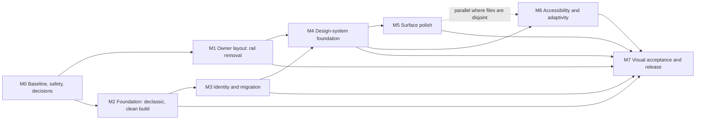
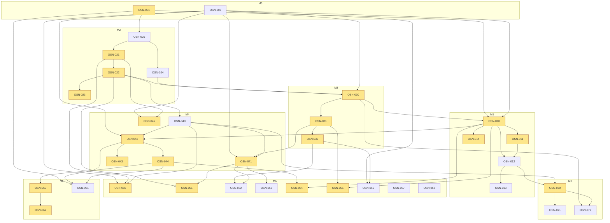

# OpenSnap visual audit: roadmap (final, round 2)

Status: **all 36 todos pending.** This roadmap and `todo-checklist.md` and `backlog.json` are generated from the same data, which is parsed from `visual-audit.md` (FINAL). Authoritative sources: `visual-audit.md` (findings, section 9 backlog, section 6.0 status at `dc1eb26`), `technical-spec.md` (implementation detail and section 0 decisions), `user-feedback.md` (owner request), `build/declassic-plan.md` (WP0 to WP7; owner decisions in section 4).

## 1. Summary

- **29 findings:** 6 P0, 16 P1, 7 P2. By evidence class: 22 rendered or measured (R/M), 6 source-only (S), 1 unverified (U, VF-27). The class rule is in section 13, item 1.
- **36 todos, all pending:** 12 P0, 20 P1, 4 P2, across eight milestones (M0 to M7). 22 are Lane A (they edit `Sources/App.swift`, one writer at a time).
- **The owner's P1 layout request** (remove the permanent right rail, `user-feedback.md`) is M1: OSN-010 to OSN-014. Section 8 of the audit reports a measured fit at 980 pt from a harness-only mock (not product). Re-measure after the change (OSN-013).
- **Landed in source at `dc1eb26` (section 6.0 and 7):** WP1 (own assets), WP2 (Classic removal, macOS 26.0), WP3 (build, runners, gates) and WP6 in part (hint copy, `analysis/` untracked). OSN-020 to OSN-023 are therefore verification only: a visual check against the cited captures plus the named gate.
- **Foundation still open:** the safe screenshot path (OSN-001, VF-06), the owner decisions (OSN-002), WP4 identity and migration (OSN-030, OSN-031; in flight on `opensnap/w3-rename`), and synthetic fixtures (OSN-024).
- **Owner input needed:** 10 decisions (section 3). Each has a recommended default from the sources; none is answered.
- **Estimate:** 18.0 d numeric across 18 todos, plus 17.5 d of unsplit spec figures, total 35.5 d (section 8). The numeric figure includes OSN-020, OSN-021, OSN-022 at their round-1 scope; those todos now need only verification (section 13, item 11).

## 2. Snapshot and evidence status

| Item | Value | Note |
|---|---|---|
| Briefed at | `b9319c4` | Footer was a 12-format popup at this SHA. |
| Main when the owner's layout feedback arrived (10:24 CDT) | `4b2ae0f` | The PNG and JPG toggle landed in `88d8865`, `f19dfde`, `4b2ae0f`. |
| Main at the final check (11:01 CDT) | `dc1eb26` | Nine commits after `4b2ae0f`. See section 2a. |
| Source line numbers | `4b2ae0f` | Re-derive every `file:line` at the SHA a todo starts from. |
| Evidence captures | `evidence/2026-10-09/`: 297 captures | 205 at `b9319c4`, 84 at `dc1eb26`, 8 PROTO mocks at `dc1eb26` (not product). Index in `README.md`. |
| Harness branch | `audit/visual-harness` @ `6ed6828` | Unmerged. OSN-001 makes it the standard path. |

### 2a. Drift since the snapshot (read before starting work)

Main moved twice during the audit: `b9319c4`, then `4b2ae0f` (10:24 CDT), then `dc1eb26` (11:01 CDT). Section 7 of the audit maps each declassic work package to its state at `dc1eb26`:

| WP | State at `dc1eb26` | Todo |
|---|---|---|
| WP0 land the PNG and JPG toggle | **Done** (`88d8865`, `f19dfde`, `4b2ae0f`) | none |
| WP1 own assets | **Landed (S)** (`fc77158`, `691b890`, `12c6dfa`) | OSN-021 (verify) |
| WP2 Classic removal and macOS 26 | **Landed (S)** (`42c52d8`, `6acc21c`) | OSN-022, OSN-023 (verify) |
| WP3 build, runners, gates | **Landed (S)** (`6acc21c`, `1b065b6`, `dc1eb26`) | OSN-020 (verify; `check-skitch-strings` not on main) |
| WP4 rename and migration | **In flight** on `opensnap/w3-rename` (uncommitted worktree `.todo-worktrees/w3-rename`) | OSN-030, OSN-031 |
| WP5 own welcome doc | **Cancelled** by owner decision D5. The synthetic-fixture half is still open (5 tests reference `original/`). | OSN-024 |
| WP6 copy, docs, analysis | **Landed in part** (`69fa060`): hint copy rewritten, `analysis/` untracked. Toolbox `...`, Destinations placeholders and History tab names remain. | OSN-032 (residuals) |
| WP7 integration and 0.4.0 | Not started | OSN-072 |

Rules that follow:

- A todo's **main state** (section 9 of the audit, copied into each checklist section) is what `dc1eb26` shows. Reconcile it against main before starting. A `pending` status does not mean the code is missing.
- T15's five `App.swift` hunks (and `App+ModernChrome.swift`, which WP4 also renames) wait until WP4 merges. T15's non-`App.swift` files (`ModernEditorChrome.swift`, `BezelDrawingControls.swift`, the `GlassChrome.swift` Metrics, and the Modern test cases) may start now on `dc1eb26`.
- Line numbers in the spec and source inventory are `4b2ae0f`. Classic-related lines are gone at `dc1eb26`, and WP4 moves them again.
- An observation is only as current as the SHA it was captured on. A footer finding seen at `b9319c4` (12-format popup) is superseded where `4b2ae0f` changed it.

## 3. Owner decisions needed

10 decisions gate work: Q1 to Q5, D-TEXT, D-HINT and D-T15-1 to D-T15-3. Each shows the recommended default from the sources and the todos it blocks. None is answered. The default is what the todos are written against until the owner decides.

| # | Question | Recommended default (source) | Blocks |
|---|---|---|---|
| Q1 | Font Awesome Pro in the shipped app: (a) licence-cleared glyph outlines compiled as vector paths, or (b) SF Symbols in release. | Visual-audit section 9 default: treat SF Symbols as the release icon set until the licence question is answered. Run visual acceptance in SF mode, and capture FA mode as a dev-only comparison. If the licence allows compiled vector outlines, ship FA as generated vector paths (spec Q1a). *(Source: visual-audit section 9 (OSN-002 defaults); technical-spec section 0 Q1.)* | OSN-045 |
| Q2 | Native document container: the JSON SketchDocument encoding becomes .opensnap, or another format. | Spec default: rename the JSON encoding to .opensnap (id com.shoemoney.opensnap.document, version 1). SVG stays an export. The old SVG-Skitch and JSON readers move to Sources/Migration/ and are not reachable from Open, drag or import. Needs docs/adr/0002. The declassic plan (section 4, D3) already fixes the .opensnap extension. *(Source: technical-spec section 0 Q2; visual-audit section 9 (Q2-Q5 as recommended in the spec).)* | OSN-030 |
| Q3 | Top bar: a real NSToolbar, or custom glass bars. | Spec default: prefer NSToolbar for the top bar after T15 lands (tools as an NSToolbarItemGroup with selectOne), gated by a spike: all 16 top-bar items unclipped at 980 pt with no overflow chevron. If the spike fails or the option is rejected, use T4 option B (custom bars). The glass budget differs between the spec's two statements: section 0 says at most 5 surfaces in total, and the T4 tests say 8. Reconcile before OSN-042 starts. *(Source: technical-spec section 0 Q3, T4 (option B and tests); visual-audit section 9 (Q2-Q5 as recommended in the spec).)* | OSN-042, OSN-043 |
| Q4 | Full screen: enable it, and how it interacts with Frame mode. | Spec default: enable full screen (.fullScreenPrimary). Full screen and Frame mode are mutually exclusive: disable or exit Frame mode while in full screen. *(Source: technical-spec section 0 Q4; visual-audit section 9.)* | OSN-043 |
| Q5 | Capture flash: keep it, and under what rule. | Spec default: keep the flash at 0.1 s, skip the ramp under Reduce Motion, and cap peak luminance at 70 %. *(Source: technical-spec section 0 Q5; visual-audit section 9.)* | OSN-050 |
| D-TEXT | Native-text exceptions to the 18-pt rule: menu bar, tooltips, NSAlert text, NSSavePanel and NSOpenPanel chrome, Fonts and Colors panels, and the standard About panel. Option (a) accepts them as platform text. Option (b) replaces them with app-owned equivalents where the app controls rendering. Plus the tooltip-only command names (VF-11). | Visual-audit section 9 default: accept system-rendered menus, tooltips, Save and Open panels, and the Fonts and Colors panels as platform text outside the 18-pt rule. App-specific alerts (permission, upload errors) become app-owned sheets at 20 pt. The About credits are set as an 18-pt attributed string. *(Source: visual-audit section 9 (OSN-002 defaults); visual-audit VF-11 (N-exceptions).)* | OSN-041, OSN-050, OSN-055 |
| D-HINT | Hover-hint bevel (OSN-056): keep it, or retire it. | Visual-audit section 9 default: keep the hover-hint bevel as an opt-in (off by default, as today), modernised. *(Source: visual-audit section 9 (OSN-002 defaults; OSN-002 row).)* | OSN-056 |
| D-T15-1 | Zoom popup face: show the percentage only (for example 83 %), with the mode word in the tooltip and the AX value. | Visual-audit section 9 default: accept. Without it, T15 does not fit at 980 in Frame mode. The alternative 160-pt popup overflows the bottom bar. *(Source: visual-audit section 8 and section 9 (D-T15-1..3); technical-spec T15 sections b and k.)* | OSN-010 |
| D-T15-2 | Size-pill arrow keys: follow NSSlider (Right and Up are larger), or keep the Classic inversion (Down is larger). | Visual-audit section 9 default: accept (Right and Up larger, Left and Down smaller, as NSSlider does). *(Source: visual-audit section 8 and section 9 (D-T15-1..3); technical-spec T15 sections d and k.)* | OSN-011 |
| D-T15-3 | Tool tile width: 44 x 40 pt (from 48 x 40). | Visual-audit section 9 default: accept (44 x 40 pt). Without it, T15 does not fit at 980 in Frame mode. *(Source: visual-audit section 8 and section 9 (D-T15-1..3); technical-spec T15 section b.)* | OSN-010 |

**Already decided (not open):** the owner's 2026-10-09 decisions in `build/declassic-plan.md` section 4. They override the plan's defaults: product name OpenSnap; bundle id `com.shoemoney.opensnap`; App Support folder `OpenSnap`; Keychain service `OpenSnap.Publishing`; environment prefix `OPENSNAP_*`; macOS 26.0 minimum (D2); one-time copy-never-move migration (D1); `.skitch` support dropped for users, with the migration as the only reader (D3); no git-history rewrite (D4); silent and minimal, with no sounds, no welcome document and drawn own icons (D5). The repo and folder rename is a separate, later, owner-approved step.

## 4. Findings

All 29 findings, from the section 6 headers (severity, evidence class, surfaces) and the section 6.0 table (status at `dc1eb26`). Categories: R/M = rendered or measured; S = source-only; U = unverified. The category is derived from the header's evidence class by the rule in section 13, item 1.

| ID | Sev | Evidence (header) | Category | Surfaces | Status at `dc1eb26` |
|---|---|---|---|---|---|
| VF-01 | P0 | S/H | S | build | Landed (S). Residual: 5 test files still reference `original/` (`ResizePresetsTests`, `LegacyHistoryImporterTests`, `SVGExportTests`, `CanvasTests`, `SkitchFileTests`). |
| VF-02 | P0 | R+S/H | R/M | S14, S24, S29, S05, S17 | Landed (S). Status item = SF `camera.viewfinder` template; drag overlays = drawn SF badges; countdown drawn |
| VF-03 | P0 | R+S/H | R/M | S01, S17, S18, S20, S24, S25, S26 | Open, in flight (WP4 on `opensnap/w3-rename`). 29 user-visible "Skitch" literals remain on `main`, e.g. "Show Skitch window in fullscreen…" and "Show Skitch in:" (`GeneralPreferencesForm.swift:37,79`); "OpenSkitch" in the title, app menu and About (`App.swift:668,725,1955`) |
| VF-04 | P0 | R/H | R/M | S17 | Landed (S). The Appearance row, Relaunch and "Play sounds" are gone; `Appearance.swift` and `ToolButton.swift` are deleted |
| VF-05 | P0 | S+M/H | R/M | all chrome | Open (decision Q1). `release.sh:30` still builds with `OPENSKITCH_NO_PRO_FONTS=1` |
| VF-06 | P0 | M+S/H | R/M | tooling | Partly. The original fixture is gone, but `tools/eye-dump.sh` still runs the bundle binary in place with the real bundle id, so the real defaults domain is still at risk |
| VF-07 | P1 | R+S(+M pending)/H | R/M | S01, S02, S11, S12 | Open |
| VF-08 | P1 | R/H | R/M | S01–S12 | Open |
| VF-09 | P1 | R+S/H | R/M | S03, S04, S09 | Open |
| VF-10 | P1 | S/H (R partial) | S | S01, S07 | Open |
| VF-11 | P1 | R+S+M/H | R/M | S01–S28 | Open |
| VF-12 | P1 | S/H | S | all | Open |
| VF-13 | P1 | R+S/H | R/M | S04, S06, S09, S20 | Open (`textColor(on:)` moved into `GlassChromeButton`; behaviour unchanged) |
| VF-14 | P1 | S/H (AX dumps captured in `evidence/…/ax/`, not yet analysed) | S | S09, S28, S19, S17 | Open |
| VF-15 | P2 | R/H | R/M | S01, S02, S07, S12 | Open |
| VF-16 | P1 | R+S/H | R/M | S16 | Open |
| VF-17 | P1 | R+S/H | R/M | S21, S09 | Open |
| VF-18 | P1 | R/H | R/M | S17, S18 | Partly (Classic rows gone). Still titled "Preferences", with a Done button and the NSTabView box |
| VF-19 | P1 | R+S/H | R/M | S19 | Open (owner-specific placeholders still at `PublishingDestinationsView.swift:214-215`) |
| VF-20 | P1 | R/H | R/M | S20 | Open ("Saved/DragMe'd" at `HistoryBrowser.swift:26`) |
| VF-21 | P2 | R+S/H | R/M | S11 | Open |
| VF-22 | P2 | S/M | S | S07 | Open |
| VF-23 | P2 | S/H | S | S30, S23, S17 | Partly. Hint copy rewritten ("Shift snaps to 45°.", no U+F8FF in copy), but the Toolbox still uses ASCII `...` (`App.swift:632-633`) |
| VF-24 | P2 | M/H | R/M | build | Landed (S) |
| VF-25 | P1 | R+S/H | R/M | S09 | Open (the drag badge is now an SF double arrow) |
| VF-26 | P1 | R+M/H | R/M | S09, S12, S21 | Open (R/M at `dc1eb26`) |
| VF-27 | P1 | R/U | U | S12 | Open / U (R at `dc1eb26`) |
| VF-28 | P2 | R/M | R/M | S02 | Open (R at `dc1eb26`) |
| VF-29 | P2 | R/H | R/M | S08 | Open (R at `b9319c4`; not re-shot) |

## 5. Milestones

Purpose, entry and exit are from section 9 of the audit. The todo counts are computed from `backlog.json`.

| Milestone | Purpose | Entry | Exit | Todos (P0/P1/P2) |
|---|---|---|---|---|
| **M0** Baseline, safety, decisions | Make the visual gate safe; record the owner decisions everything else needs | This audit committed | OSN-001 merged; OSN-002 decisions answered; the baseline gallery reproducible from the harness | OSN-001, OSN-002 (2/0/0) |
| **M1** Owner layout (rail removal) | The owner's P1 request | M0 OSN-001 (for evidence) + D-T15-1..3. App.swift hunks also need WP4 (OSN-030) merged | T15 acceptance checklist passes at 980/1024/1280/1440 + full screen, light/dark, normal/Frame | OSN-010, OSN-011, OSN-012, OSN-013, OSN-014 (0/5/0) |
| **M2** Foundation: declassic + clean build | Remove Classic and every original asset; buildable from a clean clone | M0 (mostly landed at `dc1eb26`) | Clean clone builds and tests with `original/` absent; `check-no-original` green; no test references `original/` | OSN-020, OSN-021, OSN-022, OSN-023, OSN-024 (5/0/0) |
| **M3** Identity + migration | OpenSnap ids, `.opensnap`, copy-never-move migration, OpenSnap copy | M2; Q2 | Migration tests green; `check-skitch-strings` green; old store hash unchanged | OSN-030, OSN-031, OSN-032 (2/1/0) |
| **M4** Design-system foundation | Tokens, glass consolidation, window chrome, states, icons | M3 (string-bearing files) + M1 (chrome layout) + Q1/Q3/Q4 | Token gates, glass depth/budget and the font-floor walker green | OSN-040, OSN-041, OSN-042, OSN-043, OSN-044, OSN-045 (0/6/0) |
| **M5** Surface polish | Capture, Settings, Destinations, History, upload feedback, menus/About/status, hints | M4 | Per-surface visual checklists pass | OSN-050, OSN-051, OSN-052, OSN-053, OSN-054, OSN-055, OSN-056, OSN-057, OSN-058 (0/5/4) |
| **M6** Accessibility + adaptivity | Keyboard, display options, VoiceOver | M4 (parallel with M5 where files are disjoint) | T7 tests green; injected-DisplayOptions captures reviewed; manual VoiceOver pass recorded | OSN-060, OSN-061, OSN-062 (0/3/0) |
| **M7** Visual acceptance + release readiness | Gates, full gallery, migration on a copy of real data, clean-clone release dry run | M1–M6 | Opus visual sign-off; all gates green | OSN-070, OSN-071, OSN-072 (3/0/0) |

Milestone order follows the Entry column. Two notes from the audit apply: M5 and M6 run in parallel where their files are disjoint, and M1 is owner priority, so its App.swift hunks wait for WP4 (section 2a).

### Milestone graph

### Todo dependency graph

Edges are the `Depends on` values of section 9. Lane A todos are shaded.

## 6. Ownership and parallel work

### Lane A: `Sources/App.swift` is serial

Lane A is the set of todos whose `laneA` flag is set in section 9 (22 todos). Only one implementer may edit `App.swift` at a time, in this order, which is the section 9 order:

`OSN-030 → OSN-031 → OSN-001 → OSN-010 → OSN-011 → OSN-014 → OSN-032 → OSN-041 → OSN-042 → OSN-043 → OSN-044 → OSN-045 → OSN-050 → OSN-051 → OSN-054 → OSN-055 → OSN-060 → OSN-062 → OSN-070`

OSN-021, OSN-022 and OSN-023 are also Lane A, but they have landed, so they are not in the serial sequence. Section 9 gives the sequence as shown and notes that the non-`App.swift` parts of OSN-010 and OSN-011 may start before WP4 merges.

### Collision hotspots

Counts are computed from the `files` field of each todo. Serial order is the order section 9 and the spec give, or the order the dependencies force.

| File | Todos touching it | Count | Rule |
|---|---|---|---|
| `Sources/App.swift` | 001, 010, 011, 014, 021, 022, 023, 030, 031, 032, 041, 042, 043, 044, 045, 050, 051, 054, 055, 060, 062, 070 | 22 | Lane A order above. Nothing else edits it concurrently. |
| `Sources/GlassChrome.swift` | 010, 021, 022, 041, 042, 044, 045, 060, 061 | 9 | T15 Metrics first, then WP1, WP2, the T1 sweep, then T4, T6, T7. One owner for T2 to T7. |
| `Sources/ModernEditorChrome.swift` | 010, 021, 022, 041, 042, 044, 045, 054, 060, 061, 062 | 11 | T15 first, then WP1, then T4, T9, T6, T7. One writer at a time. |
| `Sources/Canvas.swift` | 021, 030, 031, 041, 057 | 5 | WP1 (cursor, sounds), then WP4 (pasteboard, menus), then T1 (menus). OSN-057 (highlighter) joins this chain. |
| `Sources/BezelDrawingControls.swift` | 011, 021, 041, 044, 057, 062 | 6 | T15 pill (OSN-011), then WP1 (OSN-021), then T1, T2, T6. |
| `Sources/DesignTokens.swift` | 040, 044, 061 | 3 | New file. Lands before its consumers. |
| `tests/AppSafetyModernCases.swift` | 010, 011, 012, 014, 022, 031, 042, 054, 055, 062 | 10 | Serialise. Each step's owner edits it in turn. |
| `tests/GlassChromeTests.swift` | 010, 011, 012, 021, 042, 055, 061 | 7 | T15 tests first, then the GlassChrome owner. |
| `tests/AppSafetyTests.swift` | 022, 024, 031, 041 | 4 | Large file (328 KB, risk R13). Serialise edits. |
| `tools/test.py` | 020, 021, 022, 024, 030, 040, 070 | 7 | Spec order: WP3, WP1, WP4, then T14. OSN-040 adds a suite row, so merge it between WP4 and T14. |

### Work that may run in parallel

Two todos may run together when neither is Lane A and their files do not overlap. Specific cases from the data:

- OSN-057 (highlighter) and OSN-058 (Resize whole pixels) have no dependencies and are not Lane A. They may run at any time, but OSN-057 shares `Sources/Canvas.swift` with OSN-021, OSN-030, OSN-031 and OSN-041, and OSN-058 shares `Sources/ResizePanel.swift` with OSN-041 and OSN-060. Serialise those pairs.
- OSN-014 is Lane A (`enterFrame` and `performFrameSnap`). It runs after OSN-010 and in the Lane A order shown above.
- M6 todos OSN-061 (display options) and OSN-056 (hint bevel, M5) both touch the Original* motion files. Do not run them together.

## 7. Foundation blockers and polish

**Foundation (before the visual polish).** OSN-001 and OSN-002 (the safe harness and the decisions); OSN-010 (owner priority, lands before any polish that touches the bars); OSN-020 (build and gates, verification); OSN-021, OSN-022 and OSN-023 (landed; verify); OSN-024 (fixtures); OSN-030 and OSN-031 (WP4, in flight); then the gates and acceptance, OSN-070, OSN-071 and OSN-072.

**Polish (after WP4).** OSN-040 to OSN-045 (tokens, type sweep, glass, window chrome, states, icons); OSN-050 to OSN-058 (surfaces, including the two P2 items OSN-057 and OSN-058); OSN-060 to OSN-062 (accessibility). The audit's section 9 says broad visual polish waits for WP4 so each line is edited once.

## 8. Estimates

**Rule used.** A per-todo figure appears only where a spec or plan figure covers that exact scope, or where the round-2 brief gives an assumption (OSN-014, OSN-057, OSN-058). Where one spec figure covers several todos it is split as shown below and marked as an assumption. Where a spec figure has no split, the todo is `null` and the figure is listed as unsplit.

| Source figure | d | Booked to | Status |
|---|---|---|---|
| T15 (rail removal) | 4.0 | OSN-010 2.0, OSN-011 1.0, OSN-012 1.0 | Numeric. The split is an assumption (T15 gives sub-items, not per-todo figures). |
| Round-2 assumption: Frame scroller verification (T15 e) | 0.5 | OSN-014 | Numeric. New todo; the spec gives no figure, so 0.5 d is the brief's assumption. |
| Plan WP1 to WP7 sizing | 5.5 | OSN-020 0.5, OSN-021 1.0, OSN-022 1.5, OSN-024 0.5, OSN-030 1.0, OSN-032 0.5, OSN-072 0.5 | Numeric. OSN-024's figure included the cancelled welcome doc, so 0.5 is an upper bound. OSN-030's sizing predates the migration rules, so it is a floor. |
| T12 (identity copy) | 1.0 | OSN-031 | Numeric. Assumption: all of T12 is booked here. |
| T1 tokens (0.5) and type sweep (1.5) | 2.0 | OSN-040 0.5, OSN-041 1.5 | Numeric. |
| T10 (capture surfaces) | 1.5 | OSN-050 | Numeric. |
| T14 gates | 3.0 | OSN-070 | Numeric. Assumption: the roll-up line maps to this todo. |
| Round-2 assumption: highlighter | 0.25 | OSN-057 | Numeric. New todo. |
| Round-2 assumption: Resize whole pixels | 0.25 | OSN-058 | Numeric. New todo. |
| **Numeric subtotal** | **18.0** | **18 todos** | |
| T2 palette | 1.0 | M4 (OSN-040, 042, 044) | Unsplit. |
| T3 spacing and corners, residual | 0.5 | M4 | Unsplit. T1 plus T3 combined is 2.5 d; T1 (2.0 d) is booked above. |
| T4 glass (option A, roll-up midpoint) | 3.5 | OSN-042 | Unsplit. Spec range 3 to 4 d; option A is 3 d plus 1 d tests. |
| T5 icons | 1.5 | OSN-023 (M2), OSN-045 (M4) | Unsplit across two todos. |
| T6 component states | 2.0 | OSN-044 | Unsplit. |
| T7 accessibility | 2.0 | OSN-056, 060, 061, 062 | Unsplit. |
| T8 window chrome | 2.0 | OSN-043, OSN-051 | Unsplit. |
| T9 footer and upload | 2.0 | OSN-054 | Unsplit. |
| T11 settings, destinations, history | 3.0 | OSN-051, 052, 053 | Unsplit. |
| **Unsplit subtotal** | **17.5** | | |
| **Total** | **35.5** | | |

Per-todo figures (numeric, from `backlog.json`):

| Todo | d | Todo | d |
|---|---|---|---|
| OSN-010 | 2.0 | OSN-031 | 1.0 |
| OSN-011 | 1.0 | OSN-032 | 0.5 |
| OSN-012 | 1.0 | OSN-040 | 0.5 |
| OSN-014 | 0.5 | OSN-041 | 1.5 |
| OSN-020 | 0.5 | OSN-050 | 1.5 |
| OSN-021 | 1.0 | OSN-057 | 0.25 |
| OSN-022 | 1.5 | OSN-058 | 0.25 |
| OSN-024 | 0.5 | OSN-070 | 3.0 |
| OSN-030 | 1.0 | OSN-072 | 0.5 |

Per milestone, numeric only: M0 0 d; M1 4.5 d; M2 3.5 d; M3 2.5 d; M4 2.0 d; M5 2.0 d; M6 0 d; M7 3.5 d. Unsplit figures sit in the table above.

Todos with no figure (unsplit or no spec figure): OSN-001, OSN-002, OSN-013, OSN-023, OSN-042, OSN-043, OSN-044, OSN-045, OSN-051, OSN-052, OSN-053, OSN-054, OSN-055, OSN-056, OSN-060, OSN-061, OSN-062, OSN-071.

**Not reproduced.** The spec's roll-up text says "about 26 d". Its own listed items add to 29.0 d, and 26.0 d only if the T14 gate line is removed. The spec's critical-path figure ("App.swift-serial work alone is about 7.5 d") cannot be checked, because the sources do not split it per todo. Lane A todos that carry numeric figures sum to 14.5 d.

## 9. Gates

Each gate has a concrete check. Gates are wired in OSN-070 unless noted.

1. **Clean-clone build, `original/` absent, and no-original byte match.** `tools/check-no-original.py` is on main (OSN-020). The clean-clone script is a planned check (`tools/check-clean-clone.sh`, OSN-020), and its release dry run is OSN-072.
2. **No user-visible "Skitch" strings.** Static: `tools/check-skitch-strings.py`, which is not on main (section 9 of the audit: OSN-020 lists it). Dynamic: `OpenSnap --dump-strings DIR`, then a check across windows, menus, status item, tooltips, AX labels, placeholders and alerts. The dynamic launch hook is Lane A (OSN-070).
3. **Migration safety.** `tests/MigrationTests.swift` runs in a scratch home **with an injected scratch defaults suite**. `CFFIXED_USER_HOME` does not isolate `UserDefaults` (VF-06 probe). Asserts: the old tree manifest is byte-identical after the run; the new tree is complete; documents decode and equal their source; a re-run is a no-op; crash injection leaves no partial tree. The real-store guard hashes `SkitchRedux/` and `OpenSnap/`. OSN-072 runs against a copy of the owner's store.
4. **Regression tests.** Font-floor walker (`ViewTreeAuditTests`): readable text at least 18 pt; controls at least 20 pt unless caption. Glass depth and budget (`GlassDepthTests`): no glass ancestor or descendant; at most 4 bottom-bar surfaces plus the toolbar (option A), or 8 (option B); no glass frame intersects the canvas viewport. No decorative glyphs: a static scan for emoji, arrows, dingbats, U+F8FF, `º` and ASCII `...` in titles. Layout fit at 980: the Frame-mode top bar with 44-pt tool tiles has at least 10 pt of slack (T15 section b); the bottom bar keeps at least 120 pt for the status with the checkbox shown.
5. **Visual acceptance.** Light and dark, at 980, 1024, 1280, 1440 and full screen, across empty, populated, selection, text editing, Frame mode, popover open, PNG and JPG states, in FA and SF icon modes. Reduce Transparency and Increase Contrast come from injected `DisplayOptions` (OSN-061). Every capture records its `sourceSha`; every gap is recorded in `gaps.md`. Opus sign-off is recorded (OSN-071).

## 10. Risk register

Source: the spec's risk lines, the declassic plan, and the audit's structural gaps. Mitigations are as stated in the source, or the obvious check where the source gives none.

| ID | Risk | Source | Mitigation |
|---|---|---|---|
| R01 | Font Awesome Pro is not shippable in a release (licence, check-no-fonts.py) | VF-05; spec section 0 Q1 | Release runs SF Symbols until Q1 is decided. Keep the ChromeIcons seam; capture both icon modes. |
| R02 | The 18 to 20 pt type move widens rows and can break the 980 pt minimum | T1 risks | Re-measure minimumWindowWidth and the Prefs and History minimums after OSN-041. |
| R03 | Top-bar and bottom-bar widths at 980 pt rest on ESTIMATE text widths (zoom 108, toggle 143, checkbox 138, status 395) | T15 section b; section k | Re-run the T15 width budget on layout-width-budget.json before merging OSN-010. Pull the levers in order if it overflows. |
| R04 | Frame-mode hint fits with about 20 pt to spare at 1024 pt | T15 section b (Frame hint) | Shorten the hint to 'Frame: position, then Snap' with the long text in the tooltip. |
| R05 | Title-bar height (32 pt) is assumed from a Classic eye-dump, not measured on macOS 26 | T15 section k | Measure in the harness (OSN-013) and re-run the budget. |
| R06 | Whether the system popover frame is translucent on macOS 26 is unverified | T15 section d, section k | Check in the OSN-013 capture of the open popover. |
| R07 | NSToolbar may overflow or clip 16 items at 980 pt | T4 risks; Q3 | Spike gate. Fall back to option B. |
| R08 | Glass APIs are macOS 26 and 27 specific (effectIsInteractive is macOS 27, GlassChrome.swift:279) | T4 risks | Check availability at each call; the minimum OS is 26.0 (D2). |
| R09 | Moving per-control plates to layers can regress click, Control-click and menu paths | T6 risks | Keep OriginalActionButton inheritance and re-run OriginalActionButtonTests. |
| R10 | Announcements can be noisy | T7 risks | Rate-limit to state changes. |
| R11 | Full Keyboard Access and canvas Tab (tool switching) can conflict | T7 risks; OriginalHintMessages toolHoverPrefix | Keep Tab for tools, document Control-F5, add a Focus Toolbar menu command. |
| R12 | AX label and string changes ripple into AppSafetyModernCases expectations | T7 risks; T12 risks | Budget test churn inside the owning todo. |
| R13 | AppSafetyTests.swift is 328 KB; every rename and resize touches it | T1 risks; T12 risks | Serialise edits to the file (see section O). |
| R14 | Autosave plus center() changes eye-dump determinism | T8 risks | Use the isolated defaults domain in the harness. |
| R15 | Inline upload errors must not break the shutdown barrier (finishShutdownDecision expects an async alert path) | T9 risks; App.swift:403-417 | Test quit during an upload failure. |
| R16 | Screen Recording pre-flight cannot be verified in the agent sandbox | T10 risks | Keep the injection seams (environment.testDisplays, Capture.swift:388-389). |
| R17 | Renaming the bundle id resets the Screen Recording grant (TCC), so users must re-approve | T10 risks | Document in the release notes. |
| R18 | Moving Destinations and Shortcuts into Settings changes sheet assumptions and the shutdown barrier (Publishing.swift:868-880) | T11 risks | Keep sheets for modal flows from the main window; embed only in Settings. |
| R19 | Renaming menu titles breaks AppSafetyTests title lookups | T12 risks | Budget the churn inside OSN-031. |
| R20 | Migration: a crash mid-copy, Keychain prompts per item (ad-hoc signing), and a grant reset | T13 WP4; T14 G8; declassic section 1.4 | Build the tree in a temp sibling and rename atomically. Copy, never move. Status line notes Keychain prompts. |
| R21 | CFFIXED_USER_HOME does not redirect UserDefaults (10:02 probe) | VF-06 evidence; T14 G8 says use it | Migration tests use an injected scratch defaults suite and assert the real domain is unchanged. |
| R22 | Test runs leak defaults plists into ~/Library/Preferences | declassic-plan section 0 item 7 | Track separately; clean per-run domains. |
| R23 | The screenshot tool can change real settings and shows original art | VF-06 | OSN-001 retires tools/eye-dump.sh. |
| R24 | Reduce Transparency, Increase Contrast and Reduce Motion were not toggled in captures | visual-audit section 5 | Injected DisplayOptions capture mode (OSN-061). Closes the structural gap. |
| R25 | VoiceOver speech was not run; the AX dump is a structural substitute | visual-audit section 5 | Manual VoiceOver pass recorded (OSN-062). |
| R26 | Non-Retina, multi-display and live-desktop capture are not covered | visual-audit section 5 and VF-10 | Record as a known gap in gaps.md. Do not claim coverage. |
| R27 | Native-text exceptions (about 11 to 14 pt) stay visible if D-TEXT option (a) is chosen | VF-11 | Owner decision D-TEXT; record the exception list. |
| R28 | Lane A (App.swift) is serial; it is the critical path | technical-spec section O | One App.swift writer at a time, in the section 9 order. |
| R29 | No history rewrite: original-derived text metadata stays in git history | declassic-plan D4 | Accepted by the owner (D4). |
| R30 | Repo and folder rename is a separate step; links and remotes change then | declassic-plan section 4 | Out of scope for these todos. |

## 11. Outward-facing steps

Two steps in OSN-072 come from the declassic plan and are **not** to be run without the owner's explicit confirmation: the "AWS cdn" upload dry run (it touches a remote destination; the plan's acceptance names it, plan lines 159 and 360), and installing the build over the owner's copy. The release dry run must be confirmed not to publish.

## 12. Tooling not yet on main

- The harness is on `audit/visual-harness` @ `6ed6828` only. OSN-001 merges it. The branch's `tools/eye-dump-audit.sh` still has the `welcome` group and the old bundle id `com.shoemoney.skitch-redux` (verified on the branch); OSN-001 and OSN-030 change both.
- `tools/build.sh` no longer copies from `original/` (landed, VF-01), so the harness can build without a local `original/`. The build still needs the owner's toolchain.
- `tools/check-skitch-strings.py` and `tools/check-clean-clone.sh` are planned gates; neither is on main (section 9 and gate 1 above).

## 13. Source inconsistencies and how I handled them

These are places where the sources disagree, leave a gap, or have moved since round 1. Each is a question for the owner or for the implementer of the named todo.

1. **Evidence class rule.** The audit summary and the section 6 headers agree. Rule used: the class is the part of the header's evidence field before the confidence letter, with parentheses removed; a class of S alone is source-only. That gives R/M 22, S 6 (VF-01, VF-10, VF-12, VF-14, VF-22, VF-23; VF-10 has a partial R, VF-14 has pending M), U 1 (VF-27, per the brief).
2. **Glass budget for option B.** Spec section 0 (Q3) says the custom-bar fallback has at most 5 glass surfaces in total. The T4 text says 8 surfaces total for option B. Reconcile before OSN-042 starts.
3. **Estimate roll-up.** The spec's text says about 26 d; its own listed items add to 29.0 d. The listed items are used (section 8).
4. **OSN-010 depends on OSN-030.** Section 9's Depends on column reads "App.swift hunks after OSN-030". The todo's dependency list includes OSN-030 as written. Confirm whether it is a hard dependency or a merge-order rule.
5. **Lane A list.** Section 9 marks OSN-021, OSN-022 and OSN-023 as Lane A, but its serial order omits them because they have landed. The serial order in section 6 is the section 9 sequence as written.
6. **check-skitch-strings.** Section 9 names the gate in OSN-020's scope and says it is not on main. It is required by the D8 rule (section 3 of the audit) and by gate 2 above.
7. **D-TEXT blocks.** Section 9 names D-TEXT in OSN-002 and OSN-041 only. Its recommended default also covers the permission sheet (OSN-050) and the About credits (OSN-055), so those are listed as blocked. That mapping is inferred from the default text.
8. **Minimum height.** T15 sets a 608 pt minimum content height (492 pt viewport). T8 sets a 680 pt window minimum. The two stay open under OSN-043 (see its open item in the checklist); this round does not pick one.
9. **VF-27 severity.** The header says "P1 (if captured)". Treated as P1 with evidence U, as the brief directs. OSN-014 verifies it with a live capture.
10. **WP6 is partial.** The brief summary said WP6 landed. Section 7 of the audit says "landed in part". This roadmap follows section 7.
11. **Landed todos keep round-1 estimates.** OSN-020 to OSN-023 keep the round-1 scope figures (0.5, 1.0, 1.5 and unsplit). Only verification remains for them, so the numeric roll-up overstates remaining work by that amount. No figure is reduced without a basis in the sources.
12. **Harness usage.** Section 3 of the captures index names no rerun commands. The usage here comes from the header of `tools/eye-dump-audit.sh` and `tools/eye-dump-audit-assemble.py` on `audit/visual-harness`, and the README uses those forms.

**Interpretations I made as the writer.** (a) Findings "all" in section 9 (OSN-070, OSN-071) expand to VF-01 to VF-29, from the 29 section 6 headers. (b) A todo's decision list is derived from the decision blocks, and OSN-002 carries all ten. (c) OSN-010's dependency on OSN-030 is kept as written (item 4). (d) The three new todos carry the round-2 assumptions from the brief. (e) Before captures are the `@dc1eb26` capture where the surface was shot at `dc1eb26`, otherwise the `b9319c4` capture, labelled as such.

